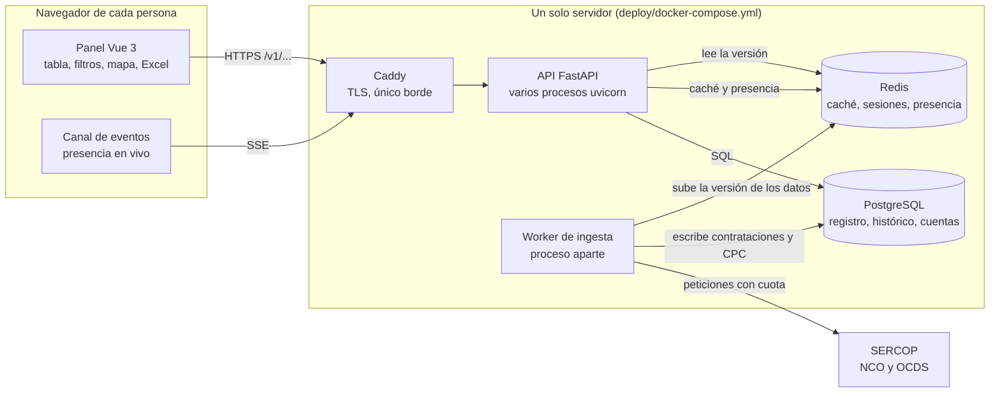
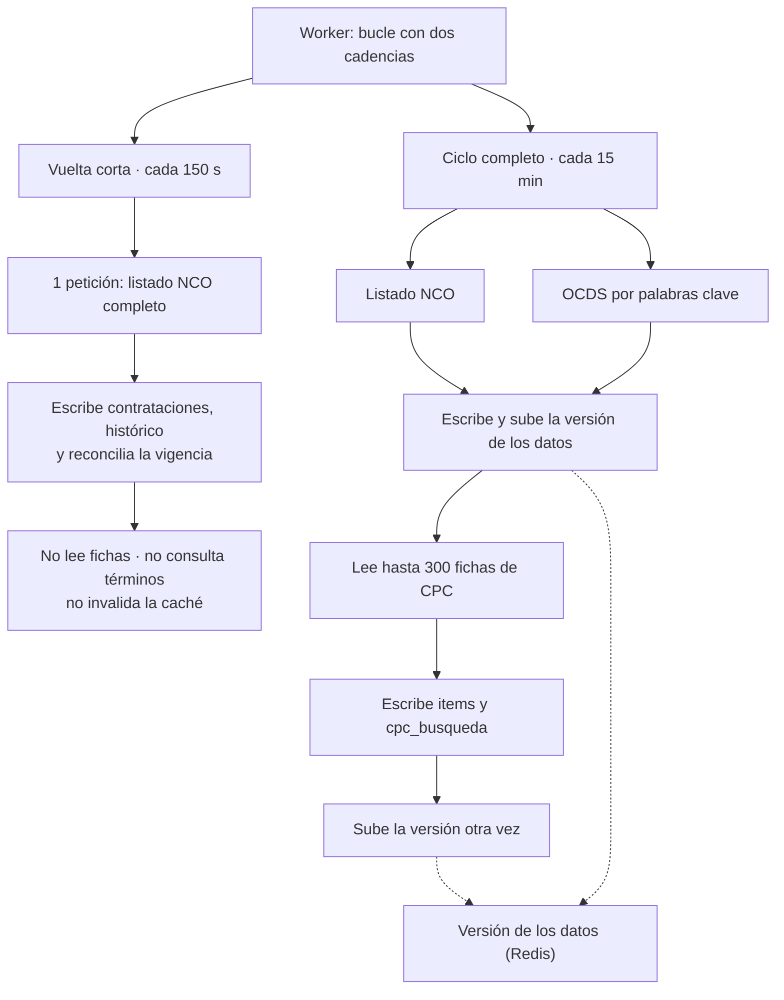
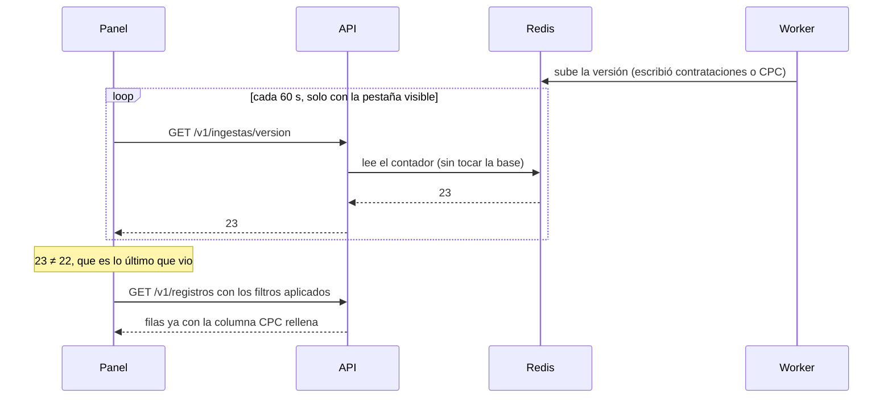
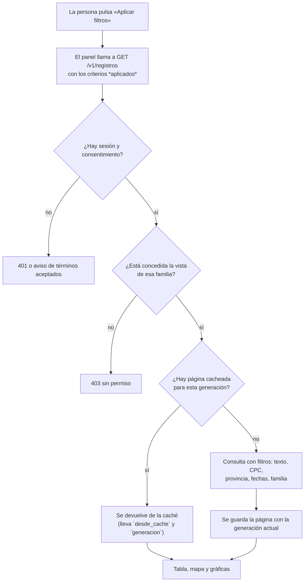

# Flujo del sistema, de un vistazo

Este documento es el mapa: quién habla con quién, en qué orden y **dónde se decide lo que la pantalla
enseña**. Está escrito para poder responder tres preguntas sin abrir el código: de dónde sale un dato,
cuánto tarda en aparecer y qué pasa cuando algo falla.

## 1. Vista general: piezas y caminos

Tres cosas que este dibujo deja claras y que explican casi todo lo demás:

- **El API nunca habla con el SERCOP.** Quien ingesta es el worker, con su propia cuota. Es lo que hace
  imposible que una petición de una persona acabe, sin querer, golpeando la fuente oficial.
- **El panel no habla con la base.** Habla con el API, que es quien decide, cachea y filtra por empresa.
- **Redis no es un adorno.** Ahí viven la caché, las sesiones —una clave ausente significa «sesión
  cerrada»— y el contador que hace que la pantalla se refresque sola.

## 2. El ciclo de ingesta: dos cadencias

**Por qué dos cadencias.** La fuente solo publica lo que está vigente: no guarda histórico. Una
necesidad que entra y sale entre dos ciclos completos no se puede recuperar después —se midió: 19
necesidades perdidas en un hueco de 49 horas—. La vuelta corta estrecha ese hueco de un cuarto de hora
a dos minutos y medio, y para poder repetirse tan a menudo deja fuera todo lo que cuesta: las fichas
de CPC, la cola de palabras clave y la invalidación de la caché.

**Y por eso el CPC no llega a los 150 s.** Cada ficha es una petición contra un origen que responde
429 con facilidad, así que se leen en el ciclo completo, donde está el presupuesto. Una necesidad
recién publicada aparece en la tabla en menos de 150 s, pero **su columna de CPC sale vacía hasta el
ciclo completo siguiente** (≤15 min). No se queda al final de una cola: las fichas se leen de la más
reciente a la más antigua.

## 3. Cuándo se actualiza la pantalla

Sin esto, lo único que refrescaba la tabla era tocar un filtro: la ingesta podía cerrar dos ciclos y la
pantalla seguía enseñando lo de antes, incluso con la necesidad ya guardada y su CPC ya leído.

Tres decisiones que están detrás del dibujo:

1. **Se pregunta por la versión, no por los datos.** La respuesta sale de la caché y no toca la base.
   Recargar la tabla a ciegas cada minuto sería lo fácil y lo caro.
2. **La versión sube también al escribir el CPC**, no solo al escribir la contratación. Es la mitad que
   se olvida: el CPC entra después de que cada fuente haya invalidado lo suyo, así que sin esa subida
   la necesidad aparecería sin su clasificación durante un cuarto de hora.
3. **Con la pestaña de fondo no se pregunta** —nadie está mirando—, y al volver se pregunta en el acto.

## 4. Una consulta del panel, paso a paso

Fíjate en el paso de la generación: la caché está clavada a una versión de los datos. Cuando la ingesta
escribe, sube la versión y **todo lo cacheado con la anterior deja de encontrarse**, que es lo que
impide servir una página vieja como si fuera nueva.

## 5. Dónde se rompe, para reconocerlo

| Síntoma | Por dónde va la cosa |
|---|---|
| «Hoy» sale vacío aunque la fuente tenga cientos de filas | El worker no está corriendo: **`uvicorn` no ingesta** |
| La tabla no cambia nunca sola | El contador de versión no sube (o el navegador está en una pestaña de fondo) |
| La necesidad aparece y su CPC no | La ficha aún no se ha leído: se lee en el ciclo completo |
| Nada nuevo en la tabla durante mucho rato | La página está servida de la caché; vive 900 s |
| «Demasiadas conexiones» o esperas | Se agotó el conjunto de conexiones de un proceso (`bd_pool_size + bd_max_overflow`) |
| El panel se queda sin presencia de golpe | Redis se reinició sin persistencia: las sesiones se van con él |
