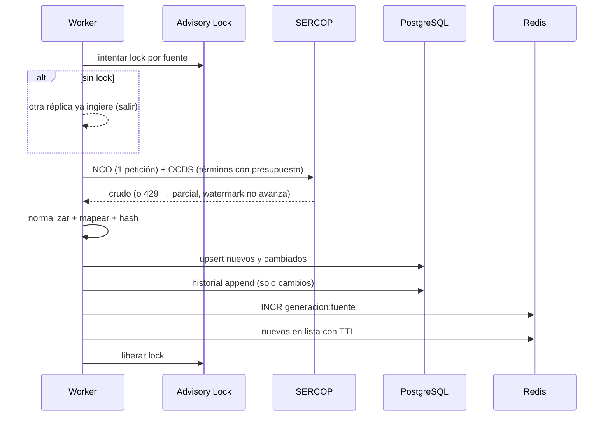
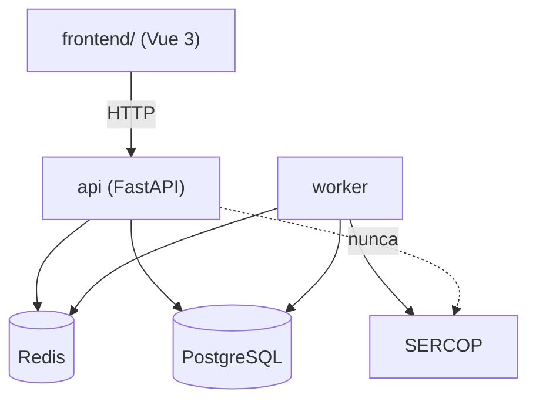
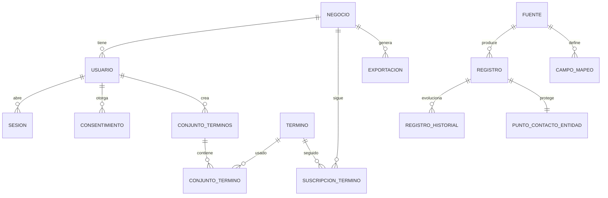

# documentacion.md
# Plataforma SERCOP Multi-Tenant — Documentación del Proyecto

| Campo | Valor |
|---|---|
| Proyecto | Plataforma de inteligencia de contratación pública (SERCOP) multi-tenant |
| Versión del documento | 0.1 (borrador) |
| Estado | En planificación — F0 no iniciada |
| Responsable de mantenimiento | Ingeniero QA |
| Última actualización | 2026-09-27 |

> **Documento vivo.** Cada fase cierra completando su sección en el capítulo 10. Una fase sin
> documentación no está terminada.

---

## 1. Resumen ejecutivo

Herramienta SaaS que convierte los datos públicos de contratación del SERCOP (Ecuador) en
información oportuna para consultorías: acumula histórico propio, permite consultas multi-palabra
de respuesta rápida, exporta a Excel sin límite y conserva evidencia de cumplimiento legal.
La arquitectura es un monolito modular con capas hexagonales, dos procesos (`api` y `worker`),
PostgreSQL con aislamiento por negocio (RLS) y Redis como capa más cercana al cliente.

**Restricción que gobierna todo el diseño:** el SERCOP limita la tasa de peticiones (HTTP 429).
Ninguna acción de un usuario puede originar una petición a la fuente; solo el `worker` la consume,
con presupuesto acotado por ciclo.

---

## 2. Objetivos

### 2.1 Objetivo general
Disponer de una plataforma comercializable, segura y auditable que entregue inteligencia de
contratación pública con datos acumulados propios, soportando 50+ negocios sin degradar el
servicio ni saturar las fuentes oficiales.

### 2.2 Objetivos específicos

| # | Objetivo | Indicador | Meta | Fase |
|---|---|---|---|---|
| OE-1 | Acumular histórico propio de contrataciones | Ciclos exitosos por día | ≥1, con 0 pérdidas sin registro | F2 |
| OE-2 | Consulta rápida para el consultor | p95 de consulta cacheada | < 300 ms | F3 |
| OE-3 | Ingesta incremental correcta | Duplicados por clave natural | 0 | F2 |
| OE-4 | Desacoplar la BD del tráfico de usuarios | Aciertos de caché en hora pico | ≥ 80% | F3 |
| OE-5 | No bloquear el SERCOP | Peticiones originadas por usuarios | 0 | F2, F3 |
| OE-6 | Cumplir la LOPDP y demostrarlo | Usuarios con consentimiento versionado | 100% | F5 |
| OE-7 | Multiusuario seguro y aislado | Fugas entre negocios detectadas | 0 | F1, F4 |
| OE-8 | Visibilidad operativa en tiempo real | Latencia del cambio de presencia | < 2 s (proactivo) / ≤ 60 s (piso) | F4 |
| OE-9 | Calidad verificable | Cobertura en dominio y aplicación | ≥ 80% | Transversal |

---

## 3. Alcance

### 3.1 Incluido
Arquitectura multi-tenant con RLS · ingesta automática cada 15 min con deduplicación global ·
mapeo automático de filas y columnas · búsqueda multi-palabra (seleccionar y agregar) · capa
Redis-first · autenticación con roles y sesiones limitadas · panel de super administrador con
presencia en tiempo real · exportación a Excel sin tope (por criterios o por selección) ·
cumplimiento LOPDP · documentación y trazabilidad por fase.

### 3.2 Excluido
Escritura hacia el SERCOP (el sistema es de solo lectura) · microservicios · aplicación móvil ·
facturación y pasarela de pago · RediSearch · despliegue dedicado por cliente · eliminación del
módulo administrativo (queda para v2).

### 3.3 Alcance por fase

| Fase | Alcance |
|---|---|
| F0 | Repositorio seguro, entorno local, esqueleto hexagonal, CI |
| F1 | Modelo relacional multi-tenant, RLS, migraciones |
| F2 | Ingesta 15 min, mapeo automático, historial |
| F3 | Caché Redis-first, multi-palabra, ingesta bajo demanda |
| F4 | Auth, sesiones, evicción, presencia, super admin |
| F5 | Cumplimiento LOPDP: consentimiento, ARCO, retención, cifrado |
| F6 | Exportación sin tope, frontend, retiro del legado |

---

## 4. Actores y partes interesadas

| Actor | Tipo | Interés |
|---|---|---|
| Consultor | Usuario | Encontrar oportunidades a tiempo y exportarlas |
| Administrador del negocio | Usuario | Gestionar su equipo y sus términos |
| Super Administrador | Usuario | Operar la plataforma, resolver mapeos, auditar |
| Planificador | Sistema | Ingesta periódica confiable |
| Titular de datos | Externo | Ejercer derechos sobre sus datos personales |
| Cliente (consultoría) | Parte interesada | Responsable del tratamiento; exige cumplimiento |
| SPDP | Regulador | Exige evidencia de cumplimiento LOPDP |

---

## 5. Requisitos

### 5.1 Funcionales

| ID | Requisito | Fase |
|---|---|---|
| RF-01 | Alta de negocios y usuarios (1 negocio : N usuarios; 1 usuario : 1 negocio) | F1 |
| RF-02 | Autenticación con access + refresh token y rotación | F4 |
| RF-03 | Máximo 2 sesiones simultáneas; el 3.º login revoca la más antigua | F4 |
| RF-04 | Estados de usuario y de sesión, con auditoría de cada cambio | F4 |
| RF-05 | Gate de primer login: lectura completa y aceptación de términos | F5 |
| RF-06 | Registro de consentimiento con versión, hash, IP y user-agent | F5 |
| RF-07 | Ingesta automática cada 15 min con ventana de solape de 2 ciclos | F2 |
| RF-08 | Alta incremental: insertar nuevos, actualizar cambiados, historial append-only | F2 |
| RF-09 | Detección automática de campos nuevos sin pérdida del payload original | F2 |
| RF-10 | Resolución de mapeos pendientes desde el panel administrativo | F2, F6 |
| RF-11 | Búsqueda con N palabras clave seleccionadas y/o agregadas, modo AND/OR | F3 |
| RF-12 | Ingesta bajo demanda al agregar una palabra clave nueva, con ventana de recuperación histórica y turno garantizado en la cola | F3 |
| RF-13 | Exportación a Excel de todos los procesos filtrados o seleccionados, sin tope | F6 |
| RF-14 | Panel de presencia: conectados/desconectados en tiempo real, verde/rojo, con motivo | F4 |
| RF-15 | Auditoría inmutable de acciones sensibles | F4, F5 |
| RF-16 | Canal de solicitudes ARCO con plazo calculado a 15 días hábiles | F5 |
| RF-17 | Exportación del Registro de Actividades de Tratamiento (RAT) | F5 |
| RF-18 | Cifrado del contacto de funcionarios y retención automática | F5 |
| RF-19 | El administrador solo ve los usuarios **registrados** en su propio negocio y su estado de conexión (verde/rojo); nunca usuarios ni datos de otro negocio | F4 |
| RF-20 | El administrador concede o retira el acceso a cada vista del panel por plazos cerrados (7 días, 30 días, 3 meses, 6 meses, 1 año) | F3.5 |
| RF-21 | El vencimiento lo calcula el backend como instante absoluto; el cliente nunca envía fechas ni plazos fuera del catálogo | F3.5 |
| RF-22 | El acceso se comprueba al leer y la retirada es inmediata, incluso con el permiso en caché | F3.5 |

### 5.2 No funcionales

| ID | Categoría | Requisito | Meta |
|---|---|---|---|
| RNF-01 | Desempeño | Consulta cacheada | p95 < 300 ms |
| RNF-02 | Desempeño | Consulta en BD | < 1,5 s |
| RNF-03 | Escalabilidad | Negocios soportados | 50+ en el primer año |
| RNF-04 | Disponibilidad | Operación si Redis cae | Degradación a BD con avisos |
| RNF-05 | Seguridad | Aislamiento entre negocios | 0 fugas; RLS forzado |
| RNF-06 | Seguridad | Almacenamiento de credenciales | Argon2id |
| RNF-07 | Seguridad | Cifrado de datos personales | AES-256-GCM en columna |
| RNF-08 | Cumplimiento | LOPDP | Consentimiento demostrable, ARCO, retención |
| RNF-09 | Mantenibilidad | Tipado y estilo | mypy estricto + ruff en CI |
| RNF-10 | Testabilidad | Cobertura dominio/aplicación | ≥ 80% |
| RNF-11 | Observabilidad | Trazabilidad de ingesta y errores | Logs estructurados + métricas por ciclo |
| RNF-12 | Portabilidad | Cambio de BD local a remota | Solo cambiar `DATABASE_URL` |
| RNF-13 | Integridad | Respuestas JSON sin `NaN`/`Infinity` | 0 ocurrencias |
| RNF-14 | Usabilidad | Claridad ante fallos parciales | Mensajes vía `avisos`, nunca error crudo |

### 5.3 Restricciones
- **R-01** Ninguna petición de usuario puede originar tráfico hacia el SERCOP.
- **R-02** Presupuesto de peticiones acotado por ciclo (configurable).
- **R-03** Un solo ciclo de ingesta concurrente (advisory lock).
- **R-04** `negocio_id` se toma siempre del JWT, nunca del cliente.
- **R-05** El rol de aplicación no puede ser superusuario (saltaría RLS).
- **R-06** NCO no expone histórico: solo se acumula desde la primera ingesta.

---

## 6. Casos de uso

### 6.1 Tabla resumen

| ID | Caso de uso | Actor | Precondición | Resultado esperado | Criterio de aceptación |
|---|---|---|---|---|---|
| CU-01 | Iniciar sesión | Todos | Usuario activo | Sesión con tokens | 3.º login expulsa la más antigua en <2 s |
| CU-02 | Aceptar términos en primer login | Todos | Primer acceso o versión nueva | Consentimiento registrado | Sin aceptar no hay acceso; se guarda versión+hash+IP+UA |
| CU-03 | Consultar con múltiples palabras clave | Consultor | Sesión activa | Resultado paginado | p95 < 300 ms; 0 llamadas a SERCOP |
| CU-04 | Agregar palabra clave nueva | Consultor | Sesión activa | Término en cola + resultados parciales | Respuesta inmediata con estado de ingesta |
| CU-05 | Ver procesos nuevos del ciclo | Consultor | Ingesta previa | Lista de nuevos | Visibles < 15 min tras publicarse |
| CU-06 | Ver historial de un proceso | Consultor | Proceso en BD | Cambios con fecha | Cada cambio tiene fecha de detección |
| CU-07 | Exportar todos los procesos filtrados | Consultor | Resultado no vacío | Archivo Excel | Sin tope; enlace válido 24 h |
| CU-08 | Ver usuarios conectados/desconectados | Admin del negocio | Rol autorizado | Panel con semáforo | Actualización asíncrona sin recargar; **solo usuarios registrados en su negocio** |
| CU-09 | Resolver mapeo de columnas pendiente | Super Admin | Existe pendiente | Campo canónico asignado | El ciclo siguiente puebla la columna |
| CU-10 | Auditar acciones | Super Admin | — | Registro consultable | Toda acción sensible registrada |
| CU-11 | Ejercer derechos ARCO | Titular | — | Solicitud registrada | Vencimiento a 15 días hábiles calculado |
| CU-12 | Sincronizar fuentes cada 15 min | Planificador | Ciclo vencido | Nuevos/actualizados + caché invalidada | 1 solo ciclo concurrente |
| CU-13 | Registrar consentimiento | Sistema | Aceptación previa | Evidencia almacenada | Versión, hash, IP y UA presentes |
| CU-14 | Gestionar usuarios del negocio | Admin del negocio | Rol autorizado | Usuario creado/editado | No puede ver datos de otro negocio |
| CU-15 | Conceder acceso a una vista por un plazo | Admin del negocio | Rol autorizado | Concesión con vencimiento | El vencimiento es ahora + el plazo, calculado en el servidor |
| CU-16 | Retirar el acceso a una vista | Admin del negocio | Existía concesión | Sin acceso y con historial | Deja de conceder en la petición siguiente |

### 6.2 Ficha CU-04 — Agregar palabra clave nueva *(caso crítico)*

| Elemento | Detalle |
|---|---|
| Actor | Consultor |
| Precondición | Sesión activa; términos permitidos por el negocio |
| Disparador | El usuario escribe y agrega un término que no está en el catálogo |
| Flujo principal | 1. El API normaliza el término y lo crea/recupera en el catálogo global. 2. Crea la suscripción del negocio. 3. Responde de inmediato con resultados parciales y `estado_ingesta`. 4. Encola el término. 5. El `worker` lo ingesta respetando el presupuesto. 6. El frontend consulta el estado y refresca. |
| Flujos alternos | 4a. El término ya tiene ingesta reciente → no se encola. 4b. El mismo término lo pidieron otros negocios → se reutiliza la ingesta (deduplicación global). |
| Excepciones | 5a. HTTP 429 → estado `parcial`, watermark **no avanza**, se avisa. 5b. Presupuesto agotado → queda `en_cola` para el ciclo siguiente. |
| Postcondición | Resultados completos cuando la ingesta termina |
| Reglas | **Nunca** se llama al SERCOP dentro del request. Backfill por año solo en OCDS; en NCO no existe histórico. |

### 6.3 Ficha CU-08 — Ver usuarios conectados/desconectados

| Elemento | Detalle |
|---|---|
| Actor | Administrador del negocio |
| Precondición | Sesión con rol autorizado |
| **Alcance de visibilidad** | **Solo usuarios registrados y pertenecientes a su propio negocio**, en cualquiera de sus estados. No puede ver usuarios de otros negocios ni cuentas de plataforma. Esto no depende del código de la consulta: el aislamiento lo impone RLS (`app.negocio_id` sale del token, nunca del cliente). |
| Flujo principal | 1. El frontend abre un canal SSE. 2. El API se suscribe a Redis Pub/Sub del negocio. 3. Emite el estado inicial. 4. Cada heartbeat o cierre publica un evento. 5. El panel repinta el color sin recargar. |
| Estados y colores | Verde `#22c55e` = conectado (presencia viva + token activo). Rojo `#ef4444` = desconectado. |
| Motivos mostrados | `logout` · `cierre_ventana` · `heartbeat_vencido` · `expirado` · `eviccion` · `admin` |
| Excepciones | Cierre abrupto del navegador → no llega el beacon → el rojo se refleja al vencer el TTL (≤60 s) |
| Postcondición | El panel refleja el estado real de **los usuarios del negocio** |

### 6.4 Diagrama de casos de uso

### 6.5 Diagrama de secuencia — ingesta y caché

---

## 7. Arquitectura

- **Estilo:** monolito modular con puertos y adaptadores. La infraestructura implementa puertos; el dominio no depende de nada.
- **Dos procesos:** `api` (tráfico de usuarios) y `worker` (ingesta, exportaciones, retención).
- **Redis-first (lectura):** `clave = hash(filtros) + generacion:fuente`; TTL = un ciclo.
- **Decisiones registradas:** ADR-000 (fundamentos, lenguaje, arquitectura, BD, Redis, planificador, migración incremental) y ADR-001 (multi-tenant, palabras clave, modelo de datos, exportación, admin desmontable).

---

## 8. Modelo de datos

**Plano compartido** (sin `negocio_id`): `fuente`, `campo_mapeo`, `campo_pendiente`, `termino`,
`registro`, `registro_historial`, `sincronizacion`.
**Plano de negocio** (`negocio_id` + RLS forzado): `negocio`, `usuario`, `sesion`,
`suscripcion_termino`, `conjunto_terminos`, `conjunto_termino`, `filtro_guardado`, `exportacion`,
`consentimiento`, `solicitud_arco`, `auditoria`, `politica_version`.
**Tablas particionadas por mes:** `registro_historial`, `auditoria`.
**Extensiones:** `pg_trgm`, `unaccent`, `pgcrypto`, `citext`.

---

## 9. Fases de desarrollo y documentación

| Fase | Objetivo | Estado | Documento | Casos de uso |
|---|---|---|---|---|
| F0 | Cimientos y seguridad del repositorio | **Completada** — 2026-09-27 | [`docs/00-fase-0.md`](docs/00-fase-0.md) | — |
| F1 | Modelo multi-tenant + RLS | **Completada** — 2026-09-27 | [`docs/01-fase-1.md`](docs/01-fase-1.md) | RF-01, CU-14 |
| F2 | Ingesta + mapeo automático | **Completada** — 2026-09-27 | [`docs/02-fase-2.md`](docs/02-fase-2.md) | CU-05, CU-06, CU-12 |
| F3 | Redis-first + multi-palabra | **Completada** — 2026-09-27 | [`docs/03-fase-3.md`](docs/03-fase-3.md) | CU-03, CU-04 |
| F3.5 | Acceso a vistas por suscripción | **Completada** — 2026-09-27 | [`docs/03b-fase-3b-acceso-vistas.md`](docs/03b-fase-3b-acceso-vistas.md) | CU-15, CU-16 |
| F4 | Auth completo, sesiones, presencia, super administrador, familias de contratación y plantilla de Excel | **Completada** — 2026-09-29 | [`docs/04-fase-4.md`](docs/04-fase-4.md) | CU-01, CU-08, CU-10, CU-14 |
| F4.1 | Exportación fiel a los filtros, columnas elegidas por empresa, informe de la plantilla y panel plegable | **Completada** — 2026-09-29 | [`docs/08-fase-4b-exportacion-columnas-panel.md`](docs/08-fase-4b-exportacion-columnas-panel.md) | CU-07, CU-09 |
| F5 | Cumplimiento LOPDP | Pendiente | `docs/05-fase-5.md` | CU-02, CU-11, CU-13 |
| F6 | Export sin tope + frontend | Pendiente | `docs/06-fase-6.md` | CU-07, CU-09 |

### 9.1 Registro de implementaciones

> Esta tabla se completa al cerrar cada fase. Una fase sin fila aquí **no está terminada**.
>
> Las filas `F4.x`, `F5`, `F6`, `F9`, `F10`, `F11`, `F12` y `F13` de esta tabla son los puntos del
> **backlog del cliente** recuperado de la sesión de trabajo, y **no** las fases del plan de arriba: el F5 del
> plan (LOPDP) y su F6 (exportación sin tope y frontend) siguen pendientes y son otra cosa. Se
> numeran como el cliente los nombró para que la conversación y el registro hablen igual.

| Fase | Fecha cierre | Implementado | Archivos/símbolos clave | Pruebas | Evidencia | Deuda |
|---|---|---|---|---|---|---|
| F0 | 2026-09-27 (parcial) | Repositorio seguro, esqueleto hexagonal, configuración con fallo rápido, app con `/salud` y `/listo`, diagnóstico de conexiones, adaptación a proveedor gestionado, CI | `.gitignore`, `.env.example`, `backend/pyproject.toml`, `ajustes.py`, `app.py`, `asgi.py`, `routers/salud.py`, `bd/sesion.py`, `cache/cliente.py`, `scripts/preparar_entorno.py`, `scripts/verificar_conexiones.py`, `.github/workflows/ci.yml` | 22 pasan · 1 omitida · integración Postgres pasa, Redis pendiente | `ruff: All checks passed` · `ruff format: 30 files` · `mypy: no issues found in 27 source files` · `pytest: 22 passed, 1 skipped` · `pip-audit: No known vulnerabilities found` · Supabase: `postgres OK` | Instalar Redis · motor atado al ciclo de vida · `uv.lock` · inicializar Git · rotar la contraseña compartida por chat |
| F1 | 2026-09-27 | Esquema completo (19 tablas), RLS forzado con políticas por negocio, particionado mensual, migraciones reversibles, caché opcional | `alembic/env.py`, `alembic/versions/0001_esquema_inicial.py`, `0002_aislamiento_rls.py`, `aplicacion/puertos/cache.py`, `cache/{cliente,nula,redis}.py`, `routers/salud.py` | 22 de unidad · 8 de integración | `ruff` y `mypy` limpios · `alembic downgrade base` → `upgrade head` sin errores · `test_un_negocio_no_ve_los_datos_de_otro` **PASSED** · `/listo` → 200 | Crear el rol de aplicación real · job de particiones futuras (F2) · verificar email único por negocio |
| F2 | 2026-09-27 | Ingesta cada 15 min con solape, mapeo dirigido por datos, detección de campos nuevos, historial *append-only*, límite de tasa y exclusión mutua, worker ejecutable | `dominio/ingesta.py`, `dominio/palabras.py`, `aplicacion/mapeo.py`, `aplicacion/casos_uso/ejecutar_ingesta.py`, `aplicacion/puertos/fuente.py`, `infraestructura/salida/bd/{ingesta,bloqueo}.py`, `infraestructura/salida/fuentes/{limitador,nco,ocds,nco_mapeos,ocds_mapeos}.py`, `tareas/{planificador,worker}.py` | 68 de unidad · 14 de integración | `ruff: All checks passed` · `ruff format: 56 files` · `mypy: no issues found in 50 source files` · idempotencia, historial, pendientes, marca de agua y caché verificados sobre PostgreSQL real · `alembic current` → `0002 (head)` **sin cambios de esquema** | `registro.terminos_ids` en F3 · mantenimiento de particiones en F3 · el worker necesita proceso persistente (no sirve un entorno sin servidor) · 48 h continuas se validan en operación |
| F3 | 2026-09-27 | Caché por delante en toda lectura con invalidación por generación, búsqueda multi-palabra con modos `todas`/`cualquiera` sobre texto completo, catálogos y estadísticas cacheadas, alta de palabras clave sin llamar a la fuente, estado de ingesta | `dominio/busqueda.py`, `dominio/serializacion.py`, `aplicacion/generaciones.py`, `aplicacion/casos_uso/{buscar_registros,encolar_termino}.py`, `salida/bd/{consultas,terminos,contexto}.py`, `routers/{busqueda,terminos,ingestas}.py` | 162 de unidad · 29 de integración | `ruff` y `mypy` limpios · 4 defectos reales corregidos, entre ellos decimales devueltos como texto y una conexión reutilizada que fallaba en lugar de denegar | El `worker` no consume aún la cola priorizada · umbrales de búsqueda por revisar con datos reales |
| F3.5 | 2026-09-27 | Concesión de acceso a vistas por plazos cerrados con vencimiento absoluto, comprobado al leer; retirada inmediata con caché; tablero de las cuatro vistas en verde y rojo; aislamiento por RLS en tabla propia | `dominio/acceso.py`, `aplicacion/{actor.py,casos_uso/gestionar_acceso.py}`, `aplicacion/puertos/accesos.py`, `salida/bd/accesos.py`, `alembic/versions/{0003_acceso_vistas,0004_politicas_contexto_vacio}.py`, `routers/accesos.py`, `scripts/estado_esquema.py` | 38 de unidad · 15 de integración | Sobre la base real con un rol sin privilegios: aislamiento forzado, contexto vacío deniega, `CHECK` rechaza plazos inventados · `estado_esquema.py` destapa que el rol actual se salta RLS | Las vistas aún no se exigen en los endpoints de lectura · presencia y aviso de vencimiento en F4 |
| F4 | 2026-09-29 | Sesiones con vida en el almacén (cierre por inactividad sin consultar la base), ventana de gracia en la rotación del token de renovación, evicción por máximo de sesiones, presencia en vivo con canal por negocio y cuadro guardado unos segundos, super administrador de plataforma, familias de contratación (ínfimas / ofertas) con hoja propia en la exportación, **pestañas separadas por familia** con el mapa eligiendo entre ínfimas, ofertas o las dos, plantilla de Excel por empresa con rechazo de macros, filtro por **varias** provincias, mensajes de sesión sin jerga técnica, **descarga fiel a la vista y a la plantilla del cliente** (cabecera buscada en las primeras filas, títulos sinónimos, filas anteriores sustituidas y una pestaña por familia) | `dominio/sesiones_vivas.py`, `dominio/presencia.py`, `aplicacion/sesiones_vivas.py`, `aplicacion/casos_uso/{presencia,autenticar}.py`, `aplicacion/plantillas.py`, `salida/archivos/local.py`, `salida/bd/{plantillas,terminos}.py`, `routers/{presencia,plantilla,busqueda}.py`, `alembic/versions/{0009_plantilla_excel,0010_gracia_rotacion}.py`, `frontend/src/components/{CampoContrasena,PlantillaExcel,MapaEcuador,VistaPanel}.vue` | 568 de unidad · 54 de integración | `ruff` y `mypy` limpios (179 y 165 archivos) · `pytest: 568 passed` · migración `0010` aplicada | Tres cierres por `reuso_detectado` en un día → ventana de gracia de 30 s (`refresh_gracia_seg`), con la fila de la sesión guardando la huella anterior · mensaje al usuario que hablaba de tokens → reemplazado en la API y en el cliente · listado de palabras clave que pedía los suscriptores término por término → una sola consulta en lote, medido de **16,7 s a 3,0 s** · **pestañas reordenadas** —Ínfimas cuantías, Ofertas, Mapa, Plantilla, Resumen, Usuarios, Empresas— con la familia fijada por la pestaña y selector de família en el mapa, verificado en el navegador: 2.210 ínfimas · 53 ofertas · 2.263 ambas · **exportación probada contra las dos plantillas realmente subidas**: una tenía los encabezados en la fila 4 y las dos usan títulos distintos a los propios («Entidad Contratante», «Descripción del Objeto de compra»), así que la cabecera se busca en las primeras diez filas y se admiten sinónimos; la descarga sustituye las filas anteriores (1.404 en la plantilla real) en lugar de arrastrarlas y manda cada familia a su pestaña · mapa que marca y desmarca con un solo clic, sin el rectángulo negro del contorno de foco | Rol de aplicación sin `BYPASSRLS` (F5) · exportación aún síncrona · prueba de carga con k6 sin ejecutar · rotar la contraseña de Redis compartida por chat |
| F4.1 | 2026-09-29 | Exportación que respeta los filtros de la pantalla (llevaba el histórico entero), **columnas elegidas por empresa** guardadas en el servidor y aplicadas al archivo, **informe de la plantilla** que dice a qué hoja va cada familia y qué títulos se reconocen, panel de filtros plegable con la preferencia recordada y **contador por familia** en las pestañas | `aplicacion/casos_uso/{exportar_registros,analizar_plantilla,gestionar_columnas,buscar_registros}.py`, `aplicacion/puertos/exportacion.py`, `salida/bd/{columnas,consultas}.py`, `routers/{plantilla,busqueda}.py`, `alembic/versions/0011_columnas_exportacion.py`, `frontend/src/components/{ColumnasExcel,AnalisisPlantilla,VistaPanel,BarraSuperior}.vue`, `frontend/src/composables/useEsMovil.js`, `frontend/src/api/endpoints.js` | 573 de unidad · 6 de integración nuevas · `verificar_exportacion.py` completo | `ruff` y `mypy` limpios (186 y 172 archivos) · esquema en `0011 (head)` · navegador: 2.210/53 que no cambian al abrir Ofertas, 519/11 al filtrar por Pichincha, panel que se pliega y recuerda, casillas que guardan 15 de 16 y el Excel sale sin «Objeto de compra» | El contador de Ofertas puede no coincidir con la tabla de esa pestaña (sus filtros son propios) · con selección activa no se añaden campos nuevos de la fuente |
| F4.2 | 2026-09-29 | **Búsqueda por palabras clave de CPC**: el listado de necesidades no publica la clasificación, así que se lee la ficha de cada necesidad (`NCORegistroDetalle.cpe`, HTML) y se guardan sus ítems —código, nombre estándar, descripción, unidad y cantidad—. Criterio de filtro `cpc` nuevo y propio, sumable al de palabras clave, con su índice de texto completo; relleno **reanudable por tandas** con cuota propia; columna **CPC** en la exportación y desglose de ítems en el detalle del panel | `dominio/cpc.py`, `salida/fuentes/{nco_detalle,nco}.py`, `salida/fuentes/limitador.py`, `aplicacion/puertos/items.py`, `aplicacion/casos_uso/recoger_items.py`, `tareas/planificador.py`, `dominio/busqueda.py`, `salida/bd/{consultas,ingesta}.py`, `casos_uso/exportar_registros.py`, `routers/busqueda.py`, `alembic/versions/0012_items_cpc.py`, `frontend/src/stores/filtros.js`, `frontend/src/utils/cpc.js`, `frontend/src/components/{PanelFiltros,TablaRegistros}.vue` | 628 de unidad · 17 nuevas de CPC y 8 del relleno · `scripts/verificar_filtros.py` con su apartado 8 | `ruff: All checks passed` · `ruff format: 196 archivos` · `mypy: no issues found in 180 source files` · `pytest: 628 passed` · esquema en `0012 (head)` · contra el portal y la base reales: la necesidad del cliente (NIC-0860001560001-2026-00083) da **17 ítems** con CPC `871410032 LAVADO Y ENGRASADO DE AUTOMOTORES` y el filtro `cpc=lavado` la encuentra, mientras que el mismo término por texto libre sigue devolviendo lo que solo lo menciona | Al desplegar quedan **2.262 fichas por leer** (~8 ciclos a 300/vuelta, ~20 min de peticiones) y hasta entonces `cpc` no filtra: se ve el desglose pero la columna del panel sale vacía · OCDS no publica CPC, así que el criterio solo tiene datos en las ínfimas · la ficha se relee al cambiar la necesidad, no cuando la entidad edita solo el detalle |
| F4.3 | 2026-10-01 | **Recuperación de la ingesta, vigilancia del listado y arreglos de operación**: cinco llamadas del caso de uso apuntaban a código inexistente, así que **cada ciclo NCO moría con cero filas** y nada lo anunciaba —proceso vivo, sincronizaciones escritas y la tabla congelada—. Ahora el campo `terminos_completos` está declarado y las cuatro escrituras por lotes existen. El worker pasa a tener **dos cadencias**: el listado de NCO cada 150 s —sin cola de términos, sin fichas y sin invalidar la caché, que a esa cadencia dejaría inservible el catálogo de desplegables— y el ciclo completo cada 15 min. La vigencia se reconcilia en las **dos** direcciones (cierra lo que desaparece y reabre lo que vuelve) y NCO se declara `listado_completo`. El filtro de CPC se aplica al guardar la lista —se guardaba, el chip aparecía y la tabla no cambiaba— con aviso del modo «Todas», que con clasificaciones alternativas devuelve cero | `aplicacion/puertos/fuente.py`, `salida/bd/ingesta.py`, `tareas/{planificador,worker}.py`, `infraestructura/config/ajustes.py`, `pruebas/unidad/test_fuente_nco.py`, `pruebas/integracion/test_ingesta_ciclo.py`, `scripts/verificar_cpc_lista.py`, `frontend/src/{stores/filtros.js,components/GestorPalabrasCpc.vue,api/cliente.js}`, `.github/agents/revisor-{ingesta,despliegue}.agent.md`, `docs/10-fase-4d-vigilancia-y-operacion.md` | 669 de unidad (7 recuperadas de la vigilancia) · prueba nueva de reapertura de vigencia · 6 del adaptador de NCO | `ruff: All checks passed` · `mypy: no issues found in 194 source files` · `pytest: 669 passed` · ciclo NCO real `ok · 143 nuevos, 0 actualizados, 1562 iguales` (1.705 filas escritas en **6 s**) · worker: `Ítems CPC: 32 fichas leídas (32 con ítems), 0 fallidas, 0 pendientes` · con la lista real de 31 términos: 3.729 ínfimas sin CPC → **294** con «cualquiera» → **0** con «todas» | La prueba de carga (k6, 900 paneles con el flujo de eventos abierto) sigue pendiente y es lo que convierte la estimación de capacidad en un hecho · **nueve de los 31 términos de CPC del cliente no existen en la nomenclatura oficial** (`atl`, `btl`, `cinemometro`…): hay que decidir si se quitan de la lista, y eso es de negocio · la cola de términos avanza a veinte palabras por ciclo, limitada por el presupuesto de la fuente |
| F4.4 | 2026-10-01 | **La pantalla se actualiza sola cuando la ingesta termina.** Hasta aquí lo único que refrescaba la tabla era tocar un filtro —el canal en vivo solo transporta presencia—, así que la ingesta podía cerrar dos ciclos con las contrataciones guardadas y su CPC leído y la pantalla seguía enseñando lo de antes. Se cierra también la mitad que se escapaba: el CPC se escribe **después** de que cada fuente invalide lo suyo, así que las páginas cacheadas salían sin columna CPC durante un cuarto de hora. Ahora el worker sube la generación al escribir CPC y el API publica `GET /v1/ingestas/version` —una lectura de caché, sin tocar la base— que el panel pregunta cada minuto (y al volver a una pestaña de fondo) para recargar con los filtros ya aplicados | `tareas/planificador.py`, `routers/ingestas.py`, `entrada/http/dependencias.py`, `scripts/estado_version.py`, `pruebas/unidad/test_vigilancia_listado.py`, `frontend/src/{api/endpoints.js,stores/datos.js,components/VistaPanel.vue}` | 672 de unidad (3 nuevas) | `ruff` y `mypy` limpios (195 archivos) · `pytest: 672 passed` · contador leído y movido: `21 → 23` observando 90 s con un ciclo en marcha · `/v1/ingestas/version` registrada **antes** de `/{codigo}` en el esquema y 401 sin sesión (no 404) | El refresco **no** se ha podido observar desde un navegador: hace falta una sesión abierta en el panel · la vuelta corta sigue sin invalidar la caché a propósito, así que lo que entra por ella aparece en pantalla con el ciclo completo |
| F4.5 | 2026-10-01 (en curso) | **La ingesta de ofertas pasa a ser general.** Medido contra la fuente: veinte palabras clave costaban ~45-60 peticiones por ciclo —unas 5.760 al día— contra un origen que responde 429 con `Retry-After` de 11-29 s; el rabo del listado general del año se sigue con **~133 peticiones al día**. Hasta aquí OCDS solo traía lo que coincidía con las palabras clave del cliente —**800 filas de las 103.628** que tiene el año—, así que los filtros del panel buscaban sobre casi nada. Ahora el worker lee el **final del listado general** (la API pagina de lo más antiguo a lo más reciente, así que lo recién publicado está al final) y las palabras clave quedan como **rescate de una sola vez**, limitado a los términos que **nunca** se han buscado: re-buscar uno ya buscado serían ~4.300 peticiones al día por datos que el rabo ya trae. El tope de páginas del rabo se estima por **tiempo** y no por las fechas de las filas —muchas publican el día sin hora y comparar contra la ventana cortaría antes de tiempo—, y el rabo **no** declara `listado_completo`, porque es una parte del listado y declararlo cerraría casi todo lo que hay en la base. Se añade el **modo relleno** del adaptador y `scripts/rellenar_ofertas_ocds.py`: reanudable, en tandas del tamaño del ciclo, que **cede el bloqueo al worker entre tandas** (con 90 s de pausa) para que el rabo siga entrando cada cuarto de hora mientras se rellena el pasado, y que se declara **parcial** para no mover la marca de agua | `salida/fuentes/ocds.py` (`FuenteOcdsGeneral`, `_paginas_a_leer`, `desde_pagina`), `tareas/planificador.py`, `infraestructura/config/ajustes.py`, `pruebas/unidad/{test_fuente_ocds,test_vigilancia_listado}.py`, `scripts/{rellenar_ofertas_ocds,verificar_relleno}.py`, `docs/12-fase-4e-ingesta-general-ocds.md` | 678 de unidad (4 nuevas del modo general y 2 del filtro del rescate) · 10 del adaptador de OCDS · 10 de integración | `ruff: All checks passed` · `ruff format: 216 archivos sin cambios` · `mypy: no issues found in 199 source files` · `pytest: 678 passed` · plan del relleno medido contra la fuente: **10.363 páginas · 103.630 filas · 1.031 MB** · tandas reales de 40 páginas: **238 y 262 filas nuevas**, sin errores · `verificar_relleno.py`: la sincronización del relleno queda `parcial` con la marca **anterior** (16:21:09) y las filas entran vigentes · el worker reiniciado registra el modo nuevo: `OCDS: sin términos por rescatar; se lee el rabo del listado general` | **El año no está relleno**: de 800 filas de OCDS se ha pasado a las que el relleno va dejando (~1.350 al escribir esto), de las 103.630, y tarda ~34 h al ritmo real medido de ~12 s por página (no los 0,6 s del intervalo mínimo) · la cola de términos ya solo significa el rescate, conviene revisar el texto de la pantalla · `ix_registro_datos` (GIN, 20,3 MB, tres cuartas partes de los índices) puede sobrar: solo lo usa la consulta de catálogos, pero retirarlo pide un `EXPLAIN` medido · el relleno no está automatizado a propósito |
| F4.6 | 2026-10-01 | **El año entero de procesos publicados, en minutos.** La vía paginada devuelve diez filas por petición y no acepta tamaño de página (se probaron ocho parámetros: los ignora), así que el año 2026 eran **10.363 peticiones** contra un origen que responde 429 cada cinco o seis: medido, ~9 s por página y **~26 horas**; subir el intervalo entre peticiones lo **empeora** (2,5 s dieron 21 s por página). El portal publica los mismos procedimientos **por meses en un ZIP** —endpoint descubierto en el script de su propia web—, así que el año son **doce peticiones**: septiembre se importó en **13 segundos** (4.634 filas, 1 petición) y los nueve meses publicados de 2026 dieron **103.135 procedimientos**, el **94 % con objeto de compra** y el **91 % con proveedor adjudicado**, campos que el listado deja a cero. El fichero es un **delta de publicaciones** (2.340 de las 4.634 de septiembre no traen `tender`), así que las filas se **combinan por `ocid`** antes de escribir: sin eso, la publicación de la adjudicación dejaría el título en blanco y la del anuncio borraría el proveedor. La tubería no se toca: el adaptador entrega la **misma fila plana** que el listado, con la equivalencia de cada campo medida contra los ficheros reales. No adelanta la marca de agua (se declara parcial: una foto con horas de retraso no cubre el final del listado) y los **ítems con CPC** que el fichero trae quedan para después, por decisión expresa | `salida/fuentes/ocds_masiva.py` (`traducir_publicacion`, `combinar`, `FuenteOcdsMasiva`), `scripts/{importar_ocds_masivo,sondear_ocds_masivo,comparar_ocds_listado_masiva}.py`, `pruebas/unidad/test_ocds_masiva.py`, `docs/13-fase-4f-descarga-masiva.md` | 710 de unidad (32 nuevas) · contraste campo a campo contra el listado · sonda del fichero contra `get-totals` | `ruff` y `mypy` limpios (204 archivos) · `pytest: 710 passed` · septiembre: 4.634 filas en **13 s** con **1 petición** (3.973 nuevas, 661 actualizadas) · año: 103.135 publicaciones → 103.135 procedimientos en 15 s de lectura, 97.057 con objeto de compra y 94.043 con proveedor · `get-totals` del año (103.628) cuadra con el listado | **Los ítems con CPC del fichero no se guardan** (4.294 solo en septiembre, con cantidad y precios): es la mejora pendiente más grande, y no haría falta volver a descargar · el `crudo` guardado es la fila plana, no el estándar completo · la importación del mes en curso no está automatizada: el fichero tiene horas de retraso y a esa frescura la da el rabo paginado · el total del fichero de un mes abierto va 3,4 % por detrás del listado (lo publicado después de generarse), que es justo lo que cubre el ciclo de quince minutos |
| F4.7 | 2026-10-01 | **El panel de plataforma enseña el trabajo de la ingesta y puede pedir un ciclo.** Hasta aquí la ingesta era una caja negra desde el panel: se veía el **último** ciclo de cada fuente y nada más —ni la serie, ni si llevaba dos horas callada, ni una racha de fallos— y no había forma de forzar una vuelta. Se añade `GET /v1/plataforma/ingesta/historial` (la serie de 24 ciclos **por fuente**, un `JOIN LATERAL` con tope por fuente porque la que más escribe se quedaría con toda la ventana si el tope fuera global) y `POST /v1/plataforma/ingesta/solicitud`. La petición **no la ejecuta el API**: se deja en la caché con `TTL` de 900 s y **se borra al recogerla** —si no, el worker la ejecutaría en cada vuelta, un ciclo cada cinco segundos—, y el worker la consume en su bucle, que ahora duerme en tramos de 5 s en vez de hasta la hora que toque: es lo que hace que el botón tenga un retardo de segundos y no de quince minutos. Un ciclo pedido a mano **es** un ciclo (se da por servida la hora y se reprograma la vigilancia). Todo ello respetando R-01/CU-07: ninguna petición de usuario origina tráfico hacia el SERCOP. En la misma tanda se arreglan las gráficas, que mentían: el reparto por provincia llegaba **recortado a doce filas** (`LIMITE_PROVINCIAS`) y se calculaba **con el filtro de provincia aplicado**, de modo que doce provincias parecían vacías y elegir una ponía las demás a cero; ahora se calcula sin ese filtro y se agrupa por la clave normalizada (sin tildes), porque agrupar por el texto crudo partía «SANTO DOMINGO DE LOS TSÁCHILAS» en dos. Y se arregla la gráfica que **nacía en blanco**: con la pestaña oculta al montarse, Chart.js no recibe aviso de que el contenedor aparece (el lienzo mide 300×150 antes y después) y la gráfica no se pintaba hasta que algo la refrescaba | `aplicacion/casos_uso/operar_ingesta.py`, `aplicacion/puertos/consultas.py`, `salida/bd/consultas.py`, `routers/plataforma.py`, `tareas/worker.py`, `pruebas/unidad/{test_operar_ingesta,test_vigilancia_listado}.py`, `frontend/src/components/{TrabajoWorkers,PanelEmpresas}.vue`, `frontend/src/composables/useGrafica.js`, `frontend/src/utils/familias.js`, `frontend/src/{api/endpoints.js,utils/formato.js}`, `scripts/{verificar_plataforma,verificar_graficas}.py`, `docs/14-fase-4g-panel-plataforma.md` | 721 de unidad (11 nuevas) · dos pruebas del bucle del worker reescritas para medir la cadencia por **tiempo acumulado** y no por número de sueños · § 10 nuevo en `verificar_plataforma.py` | `ruff: All checks passed` · `mypy: no issues found in 207 source files` · `pytest: 721 passed` · **verificado contra la API y el worker reales**: historial 200 con `['NCO','OCDS']` y 24 ciclos de cada uno · un administrador de empresa recibe **403 `sin_permiso`** en los dos endpoints · `POST` → **201** y **el worker la recogió en 3,2 s** con la fila del ciclo escrita 8 s después · `worker.err.log`: `Ciclo completo pedido desde el panel por …; se adelanta.` · en el navegador: la gráfica pinta (65.588 píxeles), el botón encola, el ciclo aparece **en marcha** y luego **terminado · 14 nuevos**, y el panel se pone al día solo (contador 335 → 345) · gráficas del mapa y del resumen: 25 provincias en el reparto, Zamora 889 = su tabla, Galápagos 375, Santa Elena 111, Santo Domingo 69 En el panel se añade además que cada gráfica del Resumen diga **qué familia está enseñando** —la fija la pestaña, así que desde la gráfica no se puede adivinar— y que se pueda **elegir cuáles se ven**, con la preferencia recordada en el navegador; la serie deja de decir «doce meses» cuando lo que dibuja son veinticuatro | Las gráficas nuevas (por entidad, tipo de procedimiento, estado o rango de monto) quedan **pendientes**: cada una exige un agregado nuevo en el servidor y hay que decidir cuáles se piden · el botón no distingue «en marcha» de «en cola» · no hay tope de peticiones por persona · la gráfica mezcla en la misma escala los ciclos del worker y las cargas masivas del año |
| F4.8 | 2026-10-02 | **Buscar una ínfima cuantía por su NIC.** El panel acotaba por palabras clave, CPC, provincia, estado y fechas, pero no por el código que la ficha publica y que todo el mundo cita: el NIC («NIC-1768120280001-2022-00003»). Se añade un campo **NIC de la ínfima cuantía** al panel lateral, que **reutiliza el criterio `codigo`** que ya existía en la API —el NIC *es* el código de la necesidad NCO, por el mapeo `codigo_contratacion` → `codigo`— y por tanto ya llegaba a la tabla, a las gráficas y a la exportación. La comparación es por fragmento (`ILIKE`), como el resto de búsquedas por código, y la consulta **no** se guarda en el caché, que ya era la regla para `codigo` | `frontend/src/stores/filtros.js`, `frontend/src/components/PanelFiltros.vue`, `backend/pruebas/unidad/test_criterios_cpc.py`, `backend/scripts/verificar_filtros.py` (§ 9), `docs/15-fase-4h-filtro-nic.md` | 723 de unidad (2 nuevas) | `ruff: All checks passed` · `mypy: no issues found in 207 source files` · `vite build: 86 módulos en 2,13 s` · contra la base real: `NIC-0360016310001-2026-00053` → **1** fila, su fragmento `26-00053` → 39, un código inventado → **0**, y `cacheable = False` | El NIC solo existe en NCO, así que con el mapa en familia «todas» el criterio compara contra el código de cualquier fuente (en la práctica no devuelve ofertas, porque sus códigos no empiezan por `NIC-`) · el guion de verificación completo es lento contra la base remota y conviene pasarlo con el API y el worker parados |
| F4.9 | 2026-10-06 | **Que las consultas del panel no recorran el histórico entero.** El histórico tiene 110.678 filas y 410 MB —180 de ellos de `TOAST`—, porque `datos` pesa unos 2 KB por fila: leerlo obliga a descomprimir fila a fila y ahí estaba casi toda la lentitud. Se añade `scripts/medir_consultas.py` (mide y **muestra el plan**, que es lo que dice si un índice se usa) y se corrigen cuatro cosas: el índice del orden por defecto, que se creó como `(fecha_publicacion DESC, id)` mientras la consulta pide `DESC NULLS LAST` —en PostgreSQL `DESC` implica `NULLS FIRST`, así que el planificador lo ignoraba y ordenaba: **10.451 ms → 7,9 ms** por página—; el orden «más antiguos», con el desempate invertido para que los dos órdenes quepan en un solo índice; la búsqueda por fragmento del **NIC**, que pasa de recorrido a índice de trigramas con `pg_trgm` —**3.385 ms → 116 ms**—; y el clic del mapa, que baja a **412 ms sin ningún índice nuevo** porque, arreglado el orden, recorrer el índice por fecha y descartar es más barato. Los tres índices de reparto que la 0015 añadió **se retiran en la 0016**, con la medición delante: no dan escaneo «solo índice» sobre una expresión que cuelga del `jsonb` y el de provincia pasó de 18,9 s a **29,8 s** | `scripts/medir_consultas.py`, `alembic/versions/{0015_indices_agregados,0016_retirar_indices_reparto}.py`, `salida/bd/consultas.py` (`ORDENES`, `PROVINCIA_AGRUPADA`, `TIPO_PROCESO_AGRUPADO`), `frontend/src/stores/datos.js`, `pruebas/unidad/test_consultas_bd.py`, `docs/16-fase-4i-rendimiento.md` | 742 de unidad (4 nuevas) · medida antes y después de los siete casos del panel | `ruff: All checks passed` · `ruff format: 229 archivos` · `mypy: no issues found in 209 source files` · `pytest: 742 passed` · `alembic current` → `0016 (head)` · página sin filtros **1.818 → 414 ms**, orden por defecto **1.967 → 406 ms**, provincia del mapa **940 → 412 ms** (8.677 ms en frío), NIC **24.376 → 365 ms** · planes: `Index Scan using ix_registro_fecha_id` y `Bitmap Index Scan on ix_registro_codigo_trgm` | Los dos repartos de las estadísticas siguen tardando **7,4–21,4 s** y los catálogos 6,4 s: leen `datos` de todas las filas y está medido que no hay índice que los salve, porque el escaneo «solo índice» no funciona sobre expresiones del `jsonb`. La salida es sacar `provincia` y `tipo_proceso` a **columnas propias** (cuesta un `UPDATE` de 110.678 filas en caliente) o precalcular el caso sin filtros en el worker · el `count(*)` del total (~230 ms) es el suelo de los 350 ms de casi todos los casos · las pruebas de carga con k6 siguen pendientes |
| F4.10 | 2026-10-06 | **Clasificar por código y deshacer de verdad una palabra clave.** El filtro por CPC devolvía un puñado de filas donde debía haber cientos, y una palabra clave dada de baja no se podía volver a dar de alta en quince minutos. El código se comparaba contra el **texto** de las descripciones en lugar de contra la columna `cpc_codigos` —que ya existía, con su índice, y **no la usaba ninguna consulta**—, así que buscar `871410032` solo funcionaba si alguien había escrito ese número dentro de la descripción; ahora un término con forma de código (`^\d{6,}$`) se compara contra el arreglo, con `@>` en modo «todas» y con `&&` en «cualquiera». Se añade el interruptor **solo CPC** —que entra en la huella del caché, o dos consultas distintas compartirían entrada—, el listado de ofertas pasa a sumar las palabras con «o», a buscar con los criterios **aplicados** en vez del borrador y pierde la columna «Estado del proceso». La baja de un término necesitaba un camino que no existía —`desuscribir` estaba escrito y no lo llamaba nadie—, y la ventana de re-encolado se medía contra la última ingesta del término en vez de contra el intervalo, que es por lo que el chip reaparecía sin que nadie hubiera buscado | `dominio/busqueda.py` (`PATRON_CODIGO_CPC`, `es_codigo_cpc`, `solo_cpc`), `salida/bd/consultas.py` (`_filtro_cpc`), `casos_uso/encolar_termino.py` (`quitar_termino`, `en_cola`), `routers/{terminos,busqueda}.py`, `frontend/src/{stores/filtros.js,components/GestorPalabrasClave.vue,components/GestorPalabrasCpc.vue,components/OfertasTab.vue,api/endpoints.js}`, `pruebas/unidad/{test_encolar_termino,test_consultas_bd,test_busqueda,test_criterios_cpc}.py`, `docs/17-fase-4j-clasificacion-y-palabras-clave.md` | 738 de unidad (16 nuevas) · `verificar_cpc_lista.py 871410032` | `ruff: All checks passed` · `mypy: no issues found in 208 source files` · `pytest: 738 passed` · `vite build: 86 módulos en 2,5 s` · contra la base real: el código `871410032` devuelve **11 filas**, el atraso de fichas quedó en **0 pendientes** (64 leídas) y 6.393 de las 6.397 ínfimas de NCO tienen ya su código | El CPC solo existe en las ínfimas de NCO: OCDS no publica clasificación, así que el criterio es útil en una pestaña y vacío en la otra · la descripción del CPC sigue buscándose por texto completo con `simple` |
| F4.11 | 2026-10-06 | **Provincia y tipo de proceso como columnas propias.** Los dos repartos de las estadísticas eran el techo del panel: 21,4 s el de provincia y 15,1 s el de tipo de proceso, y no por el plan elegido —para contar hay que leer todas las filas— sino por **qué** leían: la expresión que se agrupa cuelga de `datos`, un `jsonb` de ~2 KB por fila que vive en `TOAST` y se descomprime fila a fila. Un índice sobre la expresión **no sirve** (la 0015 lo intentó y salió once segundos peor: el planificador lo usa visitando el montón y el escaneo «solo índice» no existe sobre expresiones del `jsonb`). Se sacan los valores a dos columnas —como ya lo eran `texto_busqueda`, `cpc_busqueda` o `fecha_publicacion`— con la clave ya normalizada, calculada por la **misma función** que usa el filtro (`bd/claves.py`): la provincia sin el cantón y sin tildes, y el tipo de proceso tal cual lo publica la fuente. Las columnas son `NOT NULL` con valor por defecto —«sin provincia», «sin clasificar»— para que **ninguna fila quede fuera de un filtro** por olvidarse alguien de escribirla, y el relleno de las 110.743 filas se hace **antes** de poner el `DEFAULT`, porque en PostgreSQL 11+ un `ADD COLUMN … DEFAULT` no reescribe la tabla y las filas viejas parecerían rellenas sin estarlo. Se arregla de paso una barra que mentía: «sin clasificar» contaba 12.743 filas en el reparto y el filtro devolvía **cero** al pulsarla. Los índices se construyen **cubriendo** `fuente_id` (al final, para no romper el orden), y se documenta por qué: sin esa columna la consulta no puede ser «solo índice» y el `count(*)` del mapa pasaba de 400 ms a **9,5 s**. Se retira el GIN del `jsonb` completo —113 MB— después de medir que **ninguna consulta lo usa** | `salida/bd/claves.py`, `alembic/versions/{0017_provincia_y_tipo_proceso,0018_indices_cubridores,0019_retirar_gin_datos}.py`, `salida/bd/{ingesta,consultas}.py`, `pruebas/unidad/test_consultas_bd.py`, `docs/18-fase-4k-columnas-de-provincia-y-tipo.md` | 745 de unidad (9 nuevas) · 22 filtros y 4 repartos comparados antes y después · comprobación fila a fila del relleno · ciclo real del worker | `ruff: All checks passed` · `ruff format: 232 archivos` · `mypy: no issues found in 210 source files` · `pytest: 745 passed` · `alembic current` → `0019 (head)` · **21 de 22 filtros idénticos** y el único que cambia es el arreglo (0 → 12.743) · **0 filas con clave nula y 0 donde la clave no coincida con la regla**, recalculada desde `datos` para las 110.743 filas · reparto por provincia **21,4 s → 103 ms**, `estadisticas` **47 s → 3,6 s**, `count(*)` del mapa **9,5 s → 14 ms** · ciclo real: `20 nuevos, 0 actualizados, 1786 iguales` sin errores | La tabla tiene **~230 MB de espacio muerto** y hay que compactarla: el relleno reescribió las filas y `registro` pasó de 230 MB a 415, y la base de 410 MB a 704. `VACUUM FULL` **falló por falta de disco** —necesita ~370 MB libres para la copia— y hubo que liberar 113 MB retirando el GIN (la base quedó en 590 MB), **que no bastan para compactar**: hace falta subir el disco de la instancia · de ahí que `catálogos` tarde 8,9 s en lugar de 6,4 s (un recorrido lee 415 MB en vez de 230) · el filtro por **entidad** sigue siendo un recorrido de ~20 s · las pruebas de carga con k6, pendientes |
| F4.12 | 2026-10-06 | **Filtrar por la descripción del producto.** El panel tenía dos formas de decir qué se busca —palabras clave y CPC— y ninguna respondía a la pregunta directa: las palabras clave miran **todo** el texto de la convocatoria (código, objeto, entidad, provincia, tipos), así que quien vigila «lavado» recibe también una capacitación sobre lavado de activos; y el CPC acota por la clasificación del Estado, que la mayoría del histórico todavía no trae. Se añade un criterio que busca solo en el **objeto de compra**, con la misma semántica que las palabras clave (prefijo de palabra, modos «todas» y «cualquiera», que comparte el interruptor) y con el campo en el panel **debajo del CPC**. Se indexa la expresión normalizada del objeto —la migración `0020` tardó 44 s con el `ANALYZE`— en lugar de sacarla a columna: un `ADD COLUMN` con relleno reescribe las 111.000 filas y el disco está al límite tras la fase 4.11. El índice guarda el texto **sin tildes**, y eso obliga a que el término se normalice al entrar por la URL (el diccionario `simple` de PostgreSQL no las quita): sin ello, «CÓMPUTO» pediría `cómputo:*` y devolvería cero filas sin ningún error. A diferencia del texto libre, la descripción **sí** se guarda en el caché: es el conjunto pequeño de productos que una empresa vigila. Verificado contra la base real: «ELECTROCARDIÓGRAFO» y «ELECTROCARDIOGRAFO» dan las mismas 3 filas, «descentralizado» da 30.661 por texto y **690** por descripción, «chjimborazo» —la provincia mal escrita en el dato— da 40 y **0**, y el Excel coincide con la tabla (24 = 24) con el filtro puesto | `dominio/busqueda.py`, `alembic/versions/0020_indice_descripcion.py`, `salida/bd/consultas.py`, `routers/busqueda.py`, `frontend/src/{stores/filtros.js,components/GestorDescripcionProducto.vue,components/PanelFiltros.vue}`, `pruebas/unidad/{test_consultas_bd,test_busqueda,test_criterios_cpc}.py`, `scripts/{verificar_filtros,verificar_exportacion,medir_consultas}.py`, `docs/19-fase-4l-filtro-descripcion.md` | 766 de unidad (14 nuevas) | `ruff: All checks passed` · `ruff format: 236 archivos` · `mypy: no issues found in 211 source files` · `pytest: 766 passed` · `vite build: 88 módulos` · `alembic current` → `0020 (head)` · plan del conteo: `Bitmap Index Scan on ix_registro_objeto`, **25 ms** · página con la descripción: **380 ms** de mediana (los demás casos, 335-388 ms) · 111.117 registros | La comprobación visual del campo en el navegador necesita una sesión · el objeto sigue en el `jsonb`: moverlo a columna exige el relleno que el disco no soporta · `catálogos` se midió hoy en 14,6 s por el espacio muerto de la tabla (§ 8 de `docs/19`) |
| F4.13 | 2026-10-06 | **Sesiones: caducidad, rotación y varias pestañas.** Los dos síntomas del panel —«de vez en cuando me saca» y «me dice que no tengo permiso»— eran tres causas distintas. La primera: el verificador rechazaba igual un token manipulado y uno caducado, así que el transporte devolvía **403** en los dos casos y el cliente —que solo renueva ante un 401— **no renovaba nunca**; a los quince minutos de token de acceso, cada petición respondía «no tienes permiso para esto». Ahora la caducidad es un `TokenCaducado` (`token_caducado`, **401**) con el mismo mensaje que antes, porque distinguir el texto no ayuda a nadie: la diferencia va en el tipo, que es lo que decide el programa. La segunda: la ventana de gracia de la rotación estaba en treinta segundos y el reintento legítimo —respuesta perdida, portátil suspendido— tarda **minutos**, así que se leía como reutilización de token y el servidor cerraba **todas** las sesiones de la cuenta; pasa a cinco minutos. La tercera: cada pestaña guarda su copia de un token que **rota en cada uso**, así que con dos pestañas la segunda renovaba con una copia vieja y provocaba exactamente lo mismo; ahora la que renueva **publica el par nuevo** por un canal entre pestañas y las demás lo adoptan, y por el mismo canal se avisa del cierre para que ninguna siga fingiendo que está dentro. Se añade además **renovación anticipada**: el panel programa la renovación un minuto antes de la caducidad, con la hora que da el servidor, y descarta la respuesta que llega después de un cierre de sesión para no resucitarla | `dominio/errores.py`, `salida/seguridad/tokens.py`, `infraestructura/app.py`, `infraestructura/config/ajustes.py`, `.env.example`, `frontend/src/{api/cliente.js,stores/sesion.js}`, `pruebas/unidad/{test_token_caducado_http,test_seguridad_adaptadores,test_ajustes}.py`, `scripts/verificar_plataforma.py` (§ 11), `docs/20-sesiones-caducidad-y-pestanas.md` | 766 de unidad (7 nuevas) | `ruff: All checks passed` · `mypy: no issues found in 211 source files` · `pytest: 766 passed` · contra la API viva: caducado → **401 `token_caducado`**, manipulado → 403 `sin_permiso`, renovación caducada → 401 · `verificar_plataforma.py` § 11: el token de la generación anterior sigue valiendo **a los 35 s** —más que la ventana vieja de 30 s, cuyo valor habría cerrado todas las sesiones— y la otra sesión de la cuenta sigue viva | Abrir el panel en **dos pestañas** y comprobar que ninguna se cierra sola: el canal no tiene prueba automática (el panel no tiene marco de pruebas) · el canal de eventos (SSE) no se reconecta si la sesión se cae mientras está abierto |
| F4.14 | 2026-10-06 | **El panel de ofertas: el detalle y la url.** Dos defectos con la misma petición detrás: «al abrir una oferta se va a todo de lado» y «las urls de las ofertas no sirven». El detalle se pintaba **dentro** de la tabla, como una fila más con una celda que ocupaba las siete columnas, así que la rejilla de campos estiraba el ancho total por encima de la pantalla y las columnas se reacomodaban justo cuando la persona estaba leyendo; ahora es un **cajón lateral** fuera de la tabla, con el contenido en cinco bloques (el proceso, la entidad y el lugar, el dinero, el proveedor, las fechas) que solo se pintan si tienen datos, cierre con Escape y con el velo, foco que va y vuelve, y el desplazamiento de la página bloqueado **compensando el ancho de la barra** que desaparece —sin esa compensación el área visible de la tabla pasaba de 925 a 948 píxeles—. Y la dirección: el sistema anterior componía `.../PLATAFORMA/datos-abiertos/proceso/<ocid>`, que **devuelve 404**; la ruta real del buscador de procedimientos es `.../PLATAFORMA/ocds/<ocid>`, comprobada hoy contra el portal con un `ocid` de la base (abre la ficha con el objeto, la entidad, las etapas y el presupuesto). Se compone en el **servidor**, en el mismo campo `enlace_publico` que ya usaban las ínfimas —así el código del Excel sale con hipervínculo sin tocar la exportación—, validando el `ocid` antes de meterlo en la dirección, y **manda siempre lo que publica la fuente**: lo compuesto solo rellena el hueco que OCDS deja | `dominio/enlaces.py` (`PORTAL_OCDS`, `PATRON_OCID`, `enlace_ocds`, `enlace_del_registro`), `salida/bd/consultas.py`, `frontend/src/components/{CajonDetalleOferta,OfertasTab}.vue`, `pruebas/unidad/test_enlaces.py`, `docs/21-fase-4m-panel-de-ofertas.md` | 772 de unidad (8 nuevas) | `ruff: All checks passed` · `ruff format: 236 archivos` · `mypy: no issues found in 211 source files` · `pytest: 772 passed` · `vite build: 90 módulos` · medido en el panel con una empresa temporal (creada y borrada): ancho de la tabla **1205 px con el detalle abierto y cerrado**, columnas idénticas y área visible 925 px en los dos casos · contra el portal: la ruta vieja **404**, la nueva **200** con el proceso real · `verificar_exportacion.py` entera en verde | El aspecto del cajón queda por ver a ojo: la pestaña del navegador desde la que se verificó no repinta (§ 6.5) · los filtros de la pestaña de ofertas siguen sin provincia, estado, plazo, CPC ni descripción, que es la otra mitad de la petición (§ 8.1) |
| F4.15 | 2026-10-06 | **Los filtros de la pestaña de ofertas, como los de ínfimas cuantías.** Ahí solo se podía acotar por palabras clave en texto libre, entidad, tipo, código, fechas y fuente; el panel de ínfimas ofrece además **provincia**, **estado**, **CPC** y **descripción del producto**, así que quien vigilaba un producto tenía que buscarlo de dos maneras. Se añaden los cuatro criterios y un **solo interruptor de modo** —«todas» o «cualquiera»— que gobierna los tres campos de texto, como en el panel lateral. Las provincias son **casillas con buscador** (veinticuatro opciones se leen de un vistazo y el filtro sigue siendo la lista, para que el mapa y las casillas escriban el mismo criterio), **en la pestaña y también en el panel lateral**, donde sustituyen al desplegable que añadía y a las fichas que quitaban; el clic del mapa sigue sumando con la misma acción de siempre, y las casillas lo reflejan —verificado: pulsar Pastaza en el mapa dejó las tres marcadas y la petición con las tres—. El **estado** se apaga y se explica cuando la fuente elegida no lo publica: medido, con las 104.316 filas de datos abiertos elegir un estado devuelve **cero**. Y las tres reglas que estaban a punto de duplicarse —con qué se comparan dos términos, cuánto tienen que medir y cómo se convierte una provincia en el valor que espera la API— pasan a un solo sitio (`utils/terminos.js`, `nombreParaApi`), con la presentación del campo de términos en un componente reutilizable. Medido con datos reales: `medicamentos` → 195 filas; `+hospital` → **3.293** con «cualquiera» y **74** con «todas»; Galápagos → 303 y, con la descripción, 55 | `frontend/src/components/{CampoDeTerminos,SelectorProvincias,OfertasTab}.vue`, `frontend/src/utils/{terminos,provincias}.js`, `frontend/src/stores/filtros.js`, `docs/22-fase-4n-filtros-de-ofertas.md` | 772 de unidad (sin cambios: el servidor ya aceptaba los criterios) · comprobación de las peticiones y los totales en el panel | `ruff: All checks passed` · `mypy: no issues found in 211 source files` · `pytest: 772 passed` · `vite build: 95 módulos` · peticiones verificadas una a una (`provincia=GALAPAGOS` → 303; `descripcion=mantenimiento&modo=cualquiera` → 55; `descripcion=medicamentos&descripcion=hospital` → 3.293 y 74 según el modo; «limpiar filtros» vuelve a 104.316) | El aspecto del formulario queda por ver a ojo: la pestaña del navegador desde la que se verificó no repinta (§ 6.4) · el panel lateral no reutiliza todavía el componente de términos, así que sus tres campos mantienen su propia copia de la interacción (§ 8.1) |
| F5 · mapa | 2026-10-06 | **El mapa: Galápagos donde toca y las cifras que cambian con la familia.** El mapa estaba roto entero y no se veía: `ISLAS` valía `'Galapagos'` y el GeoJSON llama a la provincia `Galápagos`, así que la comparación fallaba en silencio, la isla entraba en el encuadre **del continente** con sus noventa y dos grados de longitud y la escala se hundía a la mitad —el país entero cabía en 209 × 229 px de un lienzo de 620—, mientras el recuadro de puntos quedaba **vacío** en la esquina opuesta. Ahora el nombre se compara **normalizado** (`utils/provincias`, la misma regla que el resto del panel) y el recuadro se calcula con la geometría: a la altura de la isla medida en la proyección del continente y con el ancho que deja libre el océano, de modo que queda **frente a la costa** que le corresponde. El continente pasa a 416 × 456 px y la isla queda dentro de su recuadro. Se comprueba además, en el panel y en el servidor, que el reparto por provincia **depende de la familia**: ínfimas 1.592/112, ofertas 28.219/303, ambas 415 en Pichincha/Galápagos, sumando 6.892 + 104.316 = 111.208. Y la ayuda del mapa hablaba de un doble clic que ya no existe | `frontend/src/utils/mapa.js` (`ISLAS`, `proyectar`, `recuadroDeLasIslas`), `frontend/src/components/VistaPanel.vue`, `backend/scripts/verificar_graficas.py` (§ 7), `docs/23-fase-5-mapa-galapagos-y-sincronia.md` | Sin pruebas automáticas nuevas (el panel no tiene ejecutor) · el apartado 7 del verificador cubre la sincronía en el servidor | `verificar_graficas.py`: todas las comprobaciones pasaron · medido en el navegador con empresa temporal · geometría medida sobre el `svg` antes y después | El `viewBox` está fijo en 620 × 520 y el hueco del recuadro depende de él · `utils/mapa.js` sin pruebas automáticas · la escala del sombreado sigue siendo lineal |
| F6 · estados y retención | 2026-10-06 | **El plazo de proformas sale del `jsonb` a una columna, y el worker se entera de que venció.** Se pidió un `worker` de «actualización de estados» y se hizo lo contrario: **quitar el estado de la base**. Un `estado = 'en plazo'/'vencida'` guardado es una copia de una cuenta que depende del reloj, y la fuente no publica nada útil —medido: las 6.896 ínfimas de NCO traen todas el mismo texto, `En Curso`—. Lo que sí hacía falta era la mitad que no se deduce: cuando un plazo cruza, las respuestas cacheadas se calcularon con la foto anterior y siguen contando como abierta una ínfima vencida **sin ningún error**. La tercera cadencia del `worker` (300 s) cuenta los cruces por ventana —cada uno una sola vez, sin guardar cuándo fue la última pasada— y sube la generación solo si algo cambió. La misma columna `registro.plazo_proformas_en`, escrita por la ingesta con guarda de patrón, deja el filtro «solo con plazo» en un rango de índice parcial en lugar de un `CAST` fila a fila. Y la retención retira, como mucho 500 por vuelta, lo vencido hace más de siete días: la purga va en **una sola sentencia** con el histórico dentro (esa tabla no tiene clave foránea), el punto de contacto se va por `ON DELETE CASCADE`, y `scripts/purgar_vencidas.py` simula por defecto. **Aviso medido:** con el valor por defecto se retiran 1.433 ínfimas en las primeras vueltas (574 MB → 574 MB: la retención de ínfimas **no** es lo que engorda la base, son las 104.316 ofertas), y **cero desactiva la retención** | `alembic/versions/0021_plazo_proformas.py`, `dominio/plazos.py` (`PATRON_FECHA_ISO`, `instante_de_limite`), `salida/bd/{ingesta,consultas,mantenimiento}.py`, `aplicacion/puertos/mantenimiento.py`, `aplicacion/casos_uso/mantener_registros.py`, `tareas/worker.py`, `config/ajustes.py`, `.env.example`, `scripts/purgar_vencidas.py`, `docs/24-fase-6-estados-y-retencion.md` | 796 de unidad (24 nuevas: `test_mantener_registros.py`, `test_plazos.py`, `test_consultas_bd.py`, `test_ajustes.py`, `test_worker.py`) | `ruff` y `mypy` limpios (216 archivos) · `alembic current` → `0021 (head)` · columna rellena en **6.897** filas y 0 sin rellenar · planes: `Index Scan` e **`Index Only Scan`** sobre `ix_registro_plazo_proformas` · retención real de 2 filas: 2 ínfimas y 24 versiones del histórico, **0 huérfanas** · `Mantenimiento: vencimientos=0 · vencidas=1433 (retiradas=500, historial=1005)` en el registro del worker | La retención reduce las estadísticas del periodo (un ajuste la cambia) · las 1.433 ínfimas son un 1,3 % de las filas: si el objetivo era el tamaño, la política tendría que mirar las ofertas de OCDS · el mantenimiento corre en el proceso del `worker` · `VACUUM FULL` sigue pendiente de sitio |
| F9 · carga | 2026-10-06 | **La prueba de carga del panel, y el techo que tiene este entorno.** Se añade `carga/panel.js` (k6) y `scripts/preparar_carga.py`: cada usuario virtual hace lo que hace una persona —tabla, gráficas y comprobación de novedades, con pausa—, con **su propia cuenta** (el panel solo deja dos sesiones por cuenta), renovando el token **con la rotación incluida** cuando recibe un 401, y con **una serie por tipo de lectura**, porque una consulta cacheada y una búsqueda por palabra clave no cuestan lo mismo y promediarlas no informa. Los umbrales se fijan con las metas del proyecto: **mediana** < 300 ms para las cacheadas —el p95 no se puede exigir a lo que siempre tiene consultas frías— y p95 < 1,5 s para la que nunca se cachea. **Lo que se ha medido, y es el hallazgo de la fase:** el Redis y el PostgreSQL de desarrollo son **remotos**, así que una consulta servida de la caché tarda 1,4–2,1 s (`desde_cache=true`) y cualquier latencia medida aquí mide la red; y el **pooler de sesión admite quince clientes**, de modo que con veinte usuarios concurrentes aparecen **10,78 % de fallos** y picos de 17,8 s en las gráficas, con **228** `EMAXCONNSESSION` en el registro del API. El entregable es la prueba y el diagnóstico: el número de usuarios sale de ejecutarla contra el despliegue, con PostgreSQL y Redis locales | `carga/panel.js`, `carga/README.md`, `backend/scripts/preparar_carga.py`, `.gitignore`, `docs/25-fase-9-prueba-de-carga.md` | Prueba ejecutada de verdad: 20 usuarios × 2 min (867 lecturas, 2,65 % fallos) y 20 × 1 min (464 lecturas, 10,78 % fallos) | `k6.exe v2.2.0` (desde el `.zip`, sin permisos de administrador) · resumen con las cuatro series (tabla 1.213/1.981, gráficas 1.052/11.724, versión 794/1.177, palabra clave 1.220/1.799 ms de mediana/p95) · `EMAXCONNSESSION` × 228 en el registro del API | La escalera hasta 1.000 usuarios **no se ha podido ejecutar** (ni las cuentas se crean a este ritmo —6,3 s por negocio— ni el pooler de 15 lo permitiría): queda para el despliegue · `preparar_carga.py` necesita un camino por lotes · no se mide el canal de eventos en vivo |
| F9b · despliegue para 1.000 | 2026-10-06 | **¿Sostiene el despliegue de Docker mil usuarios? Sí, con condiciones —y ahora se pueden comprobar.** La aritmética, pared por pared: descriptores 65.536 en `api`/`proxy` (y también en `bd`/`cache`) · conexiones (4+1) × (10+10) = **100 ≤ 200** de `max_connections` · memoria **2.836 MB de 4.096 (69 %)** · `work_mem` 16 MB de 16 MB de presupuesto · Redis con decenas de megas de consumo real frente a un límite de 512 MB. Lo que se cambió no es rendimiento: son las cosas que **rompen al llegar a mil** y no aparecen con cien. **`shm_size: 512mb`** en PostgreSQL —con los 64 MB por defecto, un `CREATE INDEX` grande falla al desplegar con «could not resize shared memory segment»—; **cierre ordenado** (60 s en la base, 30 s en Redis) porque diez segundos acaban en SIGKILL y recuperación al arrancar; **tope a los registros de Docker** (`json-file` no tiene límite por defecto y el API escribe una línea por petición: el disco se llena y el servidor se cae entero); ajustes de PostgreSQL para máquina dedicada (`effective_cache_size`, `maintenance_work_mem` y `autovacuum_work_mem` separados, autovacuum al 5 %, puntos de control más espaciados, consultas lentas al registro) con los dependientes de la máquina **parametrizados**; `--timeout-keep-alive 65` en el API; `--forwarded-allow-ips` para que la evidencia de la aceptación de términos guarde **la IP del cliente** y no la de Caddy —seguro solo porque el puerto del API sigue publicado en `127.0.0.1`, y eso se comprueba—; y liberación diferida en Redis, que tiene un solo hilo y es el que atiende los mil paneles. **No** se añadió PgBouncer (100 conexiones de 200 y la base al lado: solo añadiría un salto donde diagnosticar), **ni** límites por contenedor (un `mem_limit` mal puesto mata a PostgreSQL), **ni** se cambiaron las imágenes base: lo que estaba mal era la configuración, no la imagen | `deploy/docker-compose.yml` (bd, cache, api, worker, proxy + ancla `x-logging`), `.env.example` (bloque de capacidad con la invariante), `backend/scripts/verificar_despliegue.py`, `backend/pyproject.toml` (`pyyaml` y `types-PyYAML`), `docs/07-capacidad-y-concurrencia.md` | Guion nuevo de 9 comprobaciones, ejecutado en las dos máquinas: **4 GB → todas pasan** (2.836 MB, 69 %; `work_mem` 16 de 16 MB) y **8 GB → todas pasan** (34 %). El compose se valida con PyYAML | `ruff` y `mypy` limpios (218 archivos) · `verificar_despliegue.py` sale con 0 · `k6 v2.2.0` disponible en el servidor de pruebas | **Sigue sin medirse**: la escalera de 1.000 usuarios contra el despliegue es el paso que convierte esta aritmética en un hecho, y el único que queda. `BD_RANDOM_PAGE_COST=1.1` **cambia los planes** y hay que comprobarlos en el servidor con `scripts/medir_consultas.py` —volver a 4 es una línea— · un solo servidor no tiene recambio: escalar la máquina no resuelve eso |
| F10 · plataforma y borrado | 2026-10-06 | **Quién está conectado es del dueño del sistema, y el dueño del sistema puede borrar.** Dos cosas, y van juntas porque son la misma: la presencia —el cuadro que dice quién tiene el panel abierto— deja de ser un dato que cada empresa ve de su propia gente y pasa a verlo **solo el superadministrador**, y esa misma cuenta estrena el **borrado definitivo** de una empresa con sus cuentas y el de **una cuenta concreta**. La presencia se niega con un error y no con una lista vacía —«no hay nadie conectado» y «no puedes ver esto» son respuestas distintas— y la comprobación se hace **antes de abrir el canal de eventos**: al ser una respuesta por partes, comprobarlo solo al componer el cuadro daría un **200 con un flujo que se muere por dentro**, que el navegador no puede distinguir de una conexión correcta. El **latido sigue siendo de todos**: no cuenta nada de nadie, es la señal de vida de la propia sesión y sin él cualquiera se expulsaría solo a los minutos. El borrado es la operación más destructiva del sistema y lleva tres guardas: solo el dueño de la plataforma, **no la empresa propia** (quien lo pide se quedaría fuera sin forma de volver) y **escribir el nombre** de la empresa —o el correo de la cuenta— a mano, porque se destruye el registro de aceptación de los términos y no se recupera. Se conserva la regla de que **una empresa no puede quedarse sin administradores**. La decisión de diseño que más costó: **borrar una empresa no borra sus cuentas una a una** —un bucle dejaría la empresa medio vacía si algo fallara a mitad— sino que el `DELETE` de la empresa se las lleva por claves ajenas, en una transacción; el caso de uso las **lee** antes solo para decir cuántas eran y para cerrar su marca de sesión viva, que no se va con la fila. **Lo que no se borra:** el histórico de contratación —es de la plataforma, no del cliente: borrar uno no puede restar datos a los demás— ni la auditoría, que sobrevive para poder decir quién lo hizo. La auditoría se escribe **antes** del borrado, igual que al borrar una cuenta: el fallo que importa es el borrado que sí ocurrió y cuya anotación no | `dominio/roles.py` (`es_de_plataforma`), `casos_uso/presencia.py` (`exigir_ver_el_cuadro`, en `cuadro_del_negocio` y en `cuadro_serializado`), `routers/presencia.py`, `aplicacion/puertos/negocios.py` (`eliminar`), `salida/bd/negocios.py`, `casos_uso/administrar_negocios.py` (`eliminar_empresa`, `eliminar_cuenta_de_empresa`, `ResultadoDeBorrado`), `routers/plataforma.py` (dos `DELETE` con `confirmacion` obligatoria), `frontend/src/{utils/roles.js,stores/sesion.js,composables/usePresencia.js,components/BarraSuperior.vue,components/VistaPanel.vue,components/PanelEmpresas.vue,api/endpoints.js}`, `pruebas/unidad/{test_presencia_casos_uso,test_presencia_flujo,test_administrar_negocios,test_plataforma_rutas}.py`, `docs/26-panel-de-plataforma-eliminar-y-presencia.md` | 835 de unidad (39 nuevas) | `ruff: All checks passed` · `ruff format: 192 archivos` · `mypy: no issues found in 220 source files` · `pytest: 835 passed` · `vite build: 95 módulos en 3,20 s` · contrato comprobado contra el esquema real: las siete rutas de la plataforma dan **401** sin credenciales (no 404), y `confirmacion` figura como parámetro de query **obligatorio** en los dos borrados | La pestaña «Usuarios» de una empresa (CU-14) **no se ha tocado**: lo pedido era «usuarios conectados», que es otra cosa · el borrado real contra Postgres (que las claves ajenas se lo lleven todo y no queden huérfanos) se comprobó a mano con empresas temporales, pero no hay prueba automática que lo fije · el recorrido completo en el navegador (pulsar, escribir el nombre, ver el recuento) queda pendiente sobre datos reales |

| F11 · desglose del producto | 2026-10-06 | **El portal publicaba el desglose del producto y se estaba tirando.** El cajón de detalle de una oferta decía muy poco del producto, y la causa no era la pantalla: **0 de 104.322** ofertas tenían ítems en la base. El fichero mensual del portal sí los trae —`tender.items`, con la **clasificación CPC**, la descripción que escribe la entidad, la unidad y la cantidad—, y ahora se guardan con **la misma forma que los de las ínfimas** (`ItemCpc`), sin formato propio, para que el detalle, el filtro y la exportación sean los mismos. Contado **en local, sin tocar la base**, antes de escribir nada: de los 103.906 procedimientos del año, **96.777** traen desglose y suman **391.864 ítems** (4 por proceso); la reimportación del año escribió exactamente esos 96.777 (23 min 58 s, 10 peticiones al portal, con los ZIP ya descargados). La decisión que más importa es una **guarda**: la misma fila la escriben tres caminos y solo uno trae el desglose, así que una lista vacía **no borra** lo que ya había —sin ella, la vigilancia del listado habría dejado el detalle en blanco sin ningún error—. Y una **excepción**: el desglose no entra en la huella del contenido, así que una fila ya importada se ve «igual» que una con ítems; si el ciclo se saltara las filas iguales, reimportar el año no escribiría ni uno. **Efecto medido y asumido:** el buscador por CPC ahora encuentra también ofertas (92 % de ellas tienen clasificación), que es coherente con que su ficha enseñe el CPC. En el panel, tres cosas más: **pegar una lista** de descripciones como en el CPC, la **barra lateral** arreglada —con `overflow-y: auto` CSS convierte el otro eje en `auto`, y los dos botones del CPC no cabían en 252 px: envolvían mal y sacaban la barra horizontal— con 340 px y 308 de texto útil, y el **cajón con el bloque «El producto»**, el identificador en la fuente y el seguimiento del dato | `salida/fuentes/ocds_masiva.py` (`traducir_item`, `items_del_proceso`, `_items`), `casos_uso/ejecutar_ingesta.py`, `salida/bd/ingesta.py` (`guardar_registros` con la guarda), `frontend/src/{utils/terminos.js,utils/exportacion.js,stores/filtros.js,components/{GestorDescripcionProducto,GestorPalabrasCpc,CajonDetalleOferta,TablaRegistros}.vue}`, `pruebas/{unidad/test_ocds_masiva.py,integracion/test_ingesta_items.py}`, `docs/27-fase-4o-desglose-del-producto.md` | 851 de unidad (39 nuevas en la tanda) · **4 de integración** contra Postgres real · reimportación del año ejecutada de verdad | `ruff: All checks passed` · `mypy: no issues found in 223 source files` · `pytest: 851 passed` · `vite build: 97 módulos` · `importar_ocds_masivo.py`: **103.906 procedimientos en 23 min 58 s** (371 nuevos, 520 actualizados, 103.015 iguales) · después: **96.777 ofertas con ítems** de 104.693 (las 96.777 previstas), y todo el año 2026 | El peso de las columnas nuevas **no se ha medido** con `peso_de_datos.py` · el cajón de detalle solo existe en la pestaña de ofertas; las ínfimas tienen su detalle en línea |
| F12 · ventana de descarga | 2026-10-06 | **La descarga en Excel no lee el histórico entero.** Es la operación más cara del sistema y la única que no se puede paginar: lee todo lo que cumpla los filtros, lo recorre, arma el libro y lo serializa en memoria. Ahora cubre como mucho los **últimos tres meses** de fecha de publicación —para ínfimas, ofertas y la descarga de las dos familias—, con la regla en el dominio y comprobada **antes** de tocar la base. Se **rechaza** y no se recorta, que es la decisión de fondo: recortar en silencio rompería la propiedad que sostiene toda la exportación —el archivo y la tabla no pueden discrepar—, así que el rechazo dice el motivo y **la fecha exacta desde la que sí se puede**. La cuenta es en **meses de calendario** (no 90 días, y con el ajuste de día al último del mes: tres meses atrás desde el 31 de mayo es el 28, no un 31 de febrero) y en la **zona del negocio**, igual que el filtro de fechas del panel. En el panel, cuando el rango se sale de la ventana el botón **pone el periodo y descarga en un clic** —fijando los dos extremos, porque un `hasta` anterior al nuevo `desde` haría que se contradijeran— y una pista explica por qué; el resto no cambia: la tabla, las gráficas y el mapa siguen llegando a todo el histórico. **Lo que se encontró al verificar:** `verificar_exportacion.py` exportaba sin fecha en tres apartados y daba por rotas cosas que estaban bien (es la segunda vez que un guion de verificación se queda viejo en silencio) | `dominio/{exportacion.py,plazos.py,acceso.py}`, `casos_uso/exportar_registros.py`, `routers/busqueda.py`, `frontend/src/{utils/exportacion.js,components/TablaRegistros.vue}`, `pruebas/unidad/test_ventana_exportacion.py`, `scripts/verificar_exportacion.py` (§ 7b), `docs/28-ventana-de-descarga.md` | 851 de unidad (16 nuevas) · verificación de punta a punta contra la API en marcha: **Todas las comprobaciones pasaron** | `ruff` y `mypy` limpios (225 y 223 archivos) · fronteras medidas contra la API real: sin fecha → **422** con «2026-07-06» en el mensaje, un día antes → **422**, en el límite → **200** · en el navegador, la cuenta del panel y la del servidor dan el mismo día (`2026-07-06`) | La coincidencia de fechas entre panel y servidor se comprobó a mano, sin prueba automática · con tres meses y muchos términos a la vez se puede llegar al otro tope (el de filas), que tiene su propio mensaje |
| F13 · despliegue listo para ejecutar | 2026-10-06 | **Lo que faltaba no era el `compose` —que ya estaba— sino tres cosas que solo se ven al desplegar de verdad.** (1) **El directorio de las plantillas no existía en la imagen:** un volumen con nombre hereda contenido y dueño del directorio de la imagen *si ese directorio existe*, y no existía, así que Docker lo creaba como `root` y el proceso —que corre sin privilegios— no podía escribir; el síntoma llegaba en el primer despliegue (subir la plantilla de Excel de una empresa falla con un error de permisos) y nunca en desarrollo. (2) **El nombre de la variable del panel estaba mal en el ejemplo:** `.env.example` documentaba `VITE_API_URL` y el código lee `VITE_API_BASE`; con el nombre equivocado Vite incrusta un valor vacío al compilar y el panel llama a su propio origen, que en Vercel es un 404 en cada petición sin decir por qué. Comprobado compilando el panel con la variable puesta: la URL queda dentro del JavaScript. (3) **El pool del `.env` de desarrollo no vale para el servidor, y nada lo decía:** allí apunta a un agrupador que admite quince clientes, así que 4 + 2 es lo correcto; copiado al servidor cabe en `max_connections` y sin embargo deja el despliegue con la mitad de la concurrencia, sin fallar. `verificar_despliegue.py` ahora lo avisa (`POOL_ESPERADO_POR_PROCESO 10`, **aviso y no fallo**: hay despliegues pequeños deliberados). Y la **guía del operador** (`docs/29`), que es el entregable: dónde desplegar y por qué (VPS con Docker, con la aritmética de memoria y el reparto de la escalera de carga), los registros DNS **antes** de arrancar —Caddy pide el certificado al levantar—, la tabla completa de variables con quién lee cada una y su valor en 4 GB y en 8 GB, el orden real de arranque (migraciones → API), el panel en Vercel y la trampa de que `VITE_API_BASE` se incrusta al compilar, las copias y su restauración probada, las tres medidas que solo se pueden hacer en el servidor, la actualización y la lista de comprobación final. **Lo que no se pudo comprobar queda escrito:** en esta máquina no hay Docker, así que las imágenes nunca se han construido y el primer `up --build` del servidor es su primera vez. De paso, los nueve ficheros mensuales del portal (~130 MB) salen del control de versiones: son datos de trabajo y hacían que cada clon —el del servidor incluido— se llevara 103 MB de ZIP que no hacen falta para funcionar | `backend/Dockerfile`, `.env.example`, `.gitignore`, `backend/scripts/verificar_despliegue.py` (`_avisar`, `POOL_ESPERADO_POR_PROCESO`), `docs/29-despliegue-paso-a-paso.md`, `deploy/README.md` | `verificar_despliegue.py` con los dos perfiles: **Todas las comprobaciones pasaron** (100 ≤ 200 conexiones) y el aviso del perfil pequeño saltando con el `.env` de desarrollo sin fallar (código 0) · `compose` leído como YAML: 6 servicios y 5 volúmenes · panel compilado con `VITE_API_BASE` y comprobado dentro del bundle · 863 pruebas de unidad | `ruff` y `mypy` limpios (226 y 225 archivos) · `pytest: 863 passed` · build del panel: 97 módulos en 3,9 s | **Ninguna imagen de Docker se ha construido** (no hay Docker aquí) · el panel servido por el mismo Caddy sigue pendiente a propósito · `BD_RANDOM_PAGE_COST` sin comprobar contra el disco del servidor · la escalera de k6 sin correr contra el despliegue |

### 9.2 Plantilla obligatoria por fase (`docs/0N-fase-N.md`)

    # Fase N — <nombre>
    ## 1. Objetivo
    ## 2. Alcance (incluido / excluido)
    ## 3. Implementaciones realizadas   (qué se construyó, archivo/símbolo)
    ## 4. Decisiones tomadas y justificación
    ## 5. Casos de uso cubiertos (CU-xx) y requisitos (RF-xx / RNF-xx)
    ## 6. Pruebas ejecutadas y resultado real
    ## 7. Evidencia de aceptación (comandos y salidas)
    ## 8. Deuda técnica y pendientes
    ## 9. Riesgos abiertos y mitigaciones
    ## 10. Aprobación (QA + Revisor)

---

## 10. Plan de pruebas

| Nivel | Alcance | Herramienta | Criterio de salida |
|---|---|---|---|
| Unidad | Dominio y aplicación | pytest | Cobertura ≥80%; 0 fallos |
| Integración | Postgres y Redis reales | pytest + contenedores | Aislamiento cross-tenant = 0 filas |
| Contrato | Parseo SERCOP con fixtures | pytest | Salida idéntica a los fixtures |
| Restricciones | Rate limit, caché, idempotencia | pytest + dobles | 0 peticiones originadas por usuarios |
| Carga | p95 y aciertos de caché | herramienta de carga | p95 <300 ms; aciertos ≥80% |
| E2E | Flujo completo de usuario | navegador automatizado | Flujo sin errores de consola |
| Seguridad | Dependencias y configuración | pip-audit + revisión | 0 altas/críticas |

**Regla:** cada criterio de aceptación debe mapearse a al menos una prueba. Un criterio sin prueba es un criterio no cumplido.

---

## 11. Seguridad y cumplimiento (LOPDP)

| Control | Implementación | Fase |
|---|---|---|
| Aislamiento por negocio | RLS forzado + `negocio_id` desde el JWT | F1 |
| Credenciales | Argon2id | F4 |
| Sesiones | Máx. 2, rotación de refresh, detección de reuso | F4 |
| Datos personales | AES-256-GCM en columna + clave gestionada aparte | F5 |
| Retención | `vigente_hasta` + job automático | F5 |
| Consentimiento | Gate de primer login + registro versionado con evidencia | F5 |
| Derechos del titular | Canal ARCO con vencimiento a 15 días hábiles | F5 |
| Accountability | RAT exportable + auditoría inmutable | F5 |
| Cookies | Solo cookie de refresh `HttpOnly; Secure` (estrictamente necesaria → sin banner) | F4 |
| Brechas | Procedimiento documentado de notificación | F5 |

**Roles legales:** para los datos consultados, el **cliente es Responsable** y la plataforma
**Encargado** (Acuerdo de Encargado conforme a la normativa). Para las cuentas de usuario, la
plataforma es Responsable.
**Límite honesto:** ninguna arquitectura otorga inmunidad legal; reduce el riesgo y permite
demostrar diligencia.

---

## 12. Riesgos

| ID | Riesgo | Prob. | Impacto | Mitigación |
|---|---|---|---|---|
| RS-01 | Fuga de datos entre negocios | Media | Crítico | RLS forzado + prueba automatizada en CI |
| RS-02 | 429 sostenido detiene la ingesta | Alta | Alto | Presupuesto, cooldown, watermark que no avanza |
| RS-03 | Pérdida irreversible de histórico NCO | Alta | Alto | Arrancar F2 cuanto antes; historial append-only |
| RS-04 | Redis caído degrada el servicio | Media | Medio | Fallback a BD con avisos |
| RS-05 | Hambruna de términos en cola | Media | Medio | Prioridad + tope de antigüedad |
| RS-06 | Exportación masiva tumba el worker | Media | Medio | Proceso separado, streaming, umbral |
| RS-07 | Evicción usada como ataque | Media | Medio | Auditoría, notificación, rate limit de login |
| RS-08 | Secretos filtrados al repositorio | Media | Crítico | `.gitignore` en F0 + escaneo en CI |

---

## 13. Matriz de trazabilidad

| Objetivo | Requisitos | Casos de uso | Fase | Verificación |
|---|---|---|---|---|
| OE-1 | RF-07, RF-08 | CU-05, CU-12 | F2 | 48 h sin ciclos perdidos |
| OE-2 | RNF-01 | CU-03 | F3 | Prueba de carga p95 |
| OE-3 | RF-08 | CU-06, CU-12 | F2 | 0 duplicados |
| OE-4 | RNF-04 | CU-03 | F3 | Métrica de aciertos |
| OE-5 | R-01, R-02 | CU-04, CU-12 | F2, F3 | Auditoría de tráfico saliente |
| OE-6 | RF-05, RF-06, RF-16, RF-17 | CU-02, CU-11, CU-13 | F5 | Registro de consentimientos |
| OE-7 | RF-03, RF-04, RNF-05 | CU-01, CU-14 | F1, F4 | Prueba cross-tenant |
| OE-8 | RF-14 | CU-08 | F4 | Beacons y TTL medidos |
| OE-9 | RNF-10 | — | Transversal | Reporte de cobertura |

---

## 14. Glosario

| Término | Significado |
|---|---|
| NCO | Necesidades de Contratación (fuente del portal SERCOP) |
| OCDS | Open Contracting Data Standard (datos abiertos del SERCOP) |
| Negocio | Cliente de la plataforma (tenant); tiene N usuarios |
| RLS | Row Level Security de PostgreSQL; garantiza el aislamiento por negocio |
| Redis-first | La lectura se resuelve en Redis; la BD solo en caso de fallo de caché |
| Generación | Contador que invalida lógicamente toda la caché al cerrar un ciclo |
| Watermark | Marca de agua temporal que indica hasta dónde se ingirió |
| Ventana de solape | Margen (2 ciclos) que evita perder registros entre ejecuciones |
| Campo pendiente | Columna detectada en la fuente sin mapeo canónico definido |
| ARCO | Acceso, Rectificación, Cancelación y Oposición (derechos del titular) |
| RAT | Registro de Actividades de Tratamiento |
| LOPDP | Ley Orgánica de Protección de Datos Personales (Ecuador) |
| SPDP | Superintendencia de Protección de Datos Personales |

---

## 15. Control de cambios del documento

| Versión | Fecha | Cambio | Responsable |
|---|---|---|---|
| 0.1 | 2026-09-27 | Versión inicial: objetivos, alcance, requisitos, casos de uso, arquitectura, fases y plan de pruebas | Ingeniero QA |
| 0.2 | 2026-09-27 | Fase 0 en curso: se registran implementaciones, pruebas y evidencia real; capítulo 9.1 completado para F0 | Ingeniero QA |
| 0.3 | 2026-09-27 | Conexión a PostgreSQL gestionado (Supabase) verificada; adaptación de la URI y diagnóstico de conexiones; 5 defectos corregidos | Ingeniero QA |
| 0.4 | 2026-09-27 | Fase 1 completada: esquema de 19 tablas, aislamiento por RLS verificado con prueba automatizada, caché opcional y documentación por fase | Ingeniero QA |
| 0.5 | 2026-09-27 | Fase 2 completada sin cambios de base de datos: ingesta cada 15 min, mapeo automático de columnas, conservación del crudo y historial. Se documenta la decisión de la marca de agua en ciclos parciales. Nuevo **RF-19** y precisión del alcance del administrador en CU-08 (solo usuarios registrados y conectados de su propio negocio). Seis defectos reales encontrados por las pruebas y corregidos | Ingeniero QA |
| 0.6 | 2026-09-27 | Fases 3 y 3.5 completadas. F3: caché por delante con invalidación por generación, búsqueda multi-palabra sobre texto completo y alta de palabras clave sin llamar a la fuente. F3.5: acceso a vistas por plazos cerrados, con el vencimiento calculado en el servidor y comprobado al leer. Nuevos RF-20 a RF-22 y CU-15, CU-16. Cuatro defectos reales corregidos, entre ellos decimales devueltos como texto y, sobre todo, que una conexión reutilizada del grupo fallaba en lugar de denegar el acceso. Se añade `scripts/estado_esquema.py`, que destapa que el rol de conexión actual se salta RLS | Ingeniero QA |
| 0.7 | 2026-09-29 | Fase 4.1: la exportación deja de descargar el histórico entero —los filtros no llegaban al servidor por un desajuste de firma en el cliente—, se añaden las **columnas elegidas por empresa** (tabla `exportacion_columnas`, migración `0011`, RLS forzado y validación contra el catálogo), el **informe de la plantilla** que responde «¿dónde entran mis datos?», el **panel de filtros plegable** con preferencia recordada y los **totales por familia** en las pestañas (que ya no se contaminan al navegar). Verificado en el navegador con una empresa temporal | Ingeniero QA |
| 0.8 | 2026-09-29 | Fase 4.2: **búsqueda por CPC**, la clasificación normalizada del Estado. Hasta ahora el filtro de palabras clave solo miraba el objeto de compra —texto libre de la entidad— y por eso traía cualquier contratación que mencionara la palabra; ahora el CPC se lee de la ficha de cada necesidad (migración `0012`, cuatro columnas e índices), se rellena por tandas con cuota propia y se filtra con un criterio independiente que se puede sumar al de palabras clave. La exportación lleva una columna CPC y el detalle del panel muestra el desglose de ítems con su código y su cantidad. | Ingeniero QA |
| 0.9 | 2026-10-01 | Fase 4.3: **la ingesta estaba caída y parecía sana**. Cinco llamadas del caso de uso apuntaban a código que no existía —`terminos_completos` sin declarar y cuatro escrituras por lotes sin implementar—, y como el ciclo captura sus excepciones y las registra como «fallo inesperado», el síntoma no era un error visible sino **cero filas por ciclo**. Se recupera la ingesta y con ella se activa la **vigilancia del listado**: solo NCO cada 150 s, además del ciclo completo cada 15 min, para estrechar el hueco de una fuente que no publica histórico. La vigencia se reconcilia en las dos direcciones, NCO se declara `listado_completo` y el filtro de CPC pasa a aplicarse al guardar la lista, que es lo que se percibía como «no me deja agregar». Se añaden dos agentes revisores —**Ingesta** (¿trabajan los workers y escriben datos?) y **Despliegue** (¿se puede desplegar hoy y cuánta gente cabe, según qué evidencia?)— y `scripts/verificar_cpc_lista.py`, que dice cuánto aporta cada término de una lista de CPC | Ingeniero QA |
| 1.0 | 2026-10-01 | Fase 4.4: **el panel se pone al día solo**. Lo único que refrescaba la tabla era tocar un filtro, y el canal en vivo solo mueve presencia: la ingesta podía cerrar dos ciclos y la pantalla seguía igual. Se añade `GET /v1/ingestas/version` —la generación, una lectura de caché— que el panel pregunta cada minuto cuando la pestaña está visible, y se sube la generación al escribir los **CPC**, que entraban después de la invalidación de cada fuente y por eso aparecían sin clasificación. Se documenta además el flujo completo del sistema en `docs/11-flujo-del-sistema.md` | Ingeniero QA |
| 1.1 | 2026-10-01 | Fase 4.5: **la ingesta de ofertas pasa a ser general**. Medido contra la fuente, veinte palabras clave costaban ~5.760 peticiones al día; el listado general del año se sigue con ~133. Hasta aquí OCDS solo traía lo que coincidía con las palabras clave del cliente —800 filas de las 103.628 del año—, así que los filtros del panel buscaban sobre casi nada. Ahora el worker lee el **rabo del listado general** (lo recién publicado está al final) y las palabras clave quedan como **rescate** de una sola vez, limitado a los términos que **nunca** se han buscado —re-buscar uno ya buscado serían ~4.300 peticiones al día por datos que el rabo ya trae—. Se añade `scripts/rellenar_ofertas_ocds.py`, reanudable, para traer el año entero por tandas —10.363 páginas, ~1 GB, y ~34 h al ritmo real medido de ~12 s por página, con 429 y esperas de 20-30 s dentro—, que cede el bloqueo al worker entre tandas y **no mueve la marca de agua**, porque no cubre el final del listado. Nueva fase en `docs/12-fase-4e-ingesta-general-ocds.md` | Ingeniero QA |
| 1.2 | 2026-10-01 | Fase 4.6: **el año de procesos publicados entra en minutos, no en días.** La vía paginada del portal devuelve diez filas por petición y no acepta tamaño de página, así que completar 2026 costaba 10.363 peticiones con 429 cada cinco o seis —medido, ~26 horas—; el portal publica además los mismos procedimientos por meses en un ZIP, y son **doce peticiones**. Septiembre entró en 13 segundos y los nueve meses publicados dieron **103.135 procedimientos con el 94 % de objetos de compra y el 91 % de proveedores adjudicados**, campos que el listado dejaba a cero. El fichero es un delta de publicaciones, así que las filas se combinan por `ocid` antes de escribir. Se añaden tres guiones de medida y contraste, y queda **pendiente** lo más valioso: los ítems con **CPC** que el fichero ya trae —darían clasificación a las ofertas sin una petición por necesidad— | Ingeniero QA |
| 1.3 | 2026-10-01 | Fase 4.7: **se ve lo que trabajan los workers, y se les puede pedir un ciclo.** La pantalla de plataforma gana una tarjeta con la serie de sincronizaciones por fuente —leída de la tabla que los ciclos ya escriben, sin instrumentar nada nuevo— y un botón **Ejecutar ahora** que **no ingesta**: deja una petición en la caché con caducidad de quince minutos y el worker la consume en su bucle, que ahora duerme en tramos de cinco segundos para notarla. Un ciclo pedido a mano es un ciclo: se da por servida la hora y se reprograma la vigilancia. Verificado de extremo a extremo contra la API y el worker reales: el historial responde con las dos fuentes y 24 ciclos de cada una, un administrador de empresa recibe 403 en los dos endpoints, la petición se encola y **el worker la recogió en 3,2 s** arrancando el ciclo. Se arreglan además las gráficas, que mentían por dos motivos —el reparto por provincia llegaba **recortado a doce filas** y se calculaba con el filtro de provincia aplicado, así que doce provincias parecían vacías y elegir una ponía las demás a cero— y la gráfica que **nacía en blanco** cuando su pestaña estaba oculta al montarse: Chart.js no recibe aviso de que el contenedor aparece, y la gráfica se quedaba sin pintar hasta que algo la refrescaba, que es lo que se percibía como «las gráficas se bugean». Los tres defectos del camino —la lista de avisos que se pintaba como `[]`, el `IntersectionObserver` que tumbaba el panel entero y la carrera al comprobar el ciclo nuevo— están en `docs/14-fase-4g-panel-plataforma.md`. Queda **pendiente** que las gráficas respondan a las preguntas que se les piden | Ingeniero QA |
| 1.4 | 2026-10-02 | Fase 4.8: **buscar una ínfima cuantía por su NIC**. El panel ya acotaba por palabras clave, CPC, provincia, estado y fechas, pero no por el código que la ficha publica —el NIC—, así que quien tenía un `NIC-…` delante no podía pedir esa necesidad. Se añade el campo al panel lateral **sin tocar la API**: el NIC es el `codigo` de la necesidad NCO —el mapeo de la fuente lo traduce— y ese criterio ya existía, ya llegaba al `WHERE` y ya viajaba a la tabla, las gráficas y la exportación. La búsqueda es por fragmento y no se guarda en el caché, que es la regla que `Filtros.cacheable` ya aplicaba al código. Verificado contra la base real con un NIC de verdad: encuentra su fila, un fragmento encuentra la suya y sus vecinas, y un código inventado devuelve cero | Ingeniero QA |
| 1.5 | 2026-10-06 | Fase 4.10: **clasificar por código y deshacer de verdad una palabra clave**. Dos defectos que se tapaban entre sí: el filtro por CPC devolvía un puñado de filas donde debía haber cientos, y una palabra clave dada de baja no se podía volver a dar de alta en quince minutos. El código de CPC se comparaba contra el **texto** de las descripciones en lugar de contra la columna de códigos que ya existía con su índice, así que buscar `871410032` solo funcionaba si alguien había escrito ese número dentro de la descripción; ahora un término con forma de código (`^\d{6,}$`) se compara contra el arreglo con `@>` en modo «todas» y con `&&` en «cualquiera». Se añade el interruptor **solo CPC** —que entra en la huella del caché, o dos consultas distintas compartirían entrada— y el **listado de ofertas** pasa a sumar las palabras con «o» en lugar de con «y», a buscar con los criterios **aplicados** en vez del borrador y pierde la columna «Estado del proceso». La baja de un término necesitaba un camino que no existía: `RepositorioTerminos.desuscribir` estaba escrito y no lo llamaba nadie; se añade `POST /v1/terminos/quitar` y se arregla la ventana de re-encolado, que se medía contra la última ingesta del término —de hacía un cuarto de hora— en vez de contra el intervalo. Verificado contra la base real: el código `871410032` devuelve **11 filas** y el atraso de fichas sin leer quedó en cero —64 leídas, **0 pendientes**—, con 6.393 de las 6.397 ínfimas ya clasificadas | Ingeniero QA |
| 1.6 | 2026-10-06 | Fase 4.11: **provincia y tipo de proceso pasan a ser columnas propias**. El reparto por provincia tardaba 21,4 s y el de tipo de proceso 15,1 s, y no era culpa del plan: para contar hay que leer todas las filas, así que lo único que los hacía lentos era **qué** leían —la expresión que se agrupa cuelga de `datos`, un `jsonb` de 2 KB por fila que se descomprime fila a fila—. Y ningún índice lo arreglaba: la fase 4.9 lo intentó y el planificador usaba el índice visitando el montón, once segundos **peor**. La salida es la que ya se había tomado con `texto_busqueda` y `cpc_busqueda`: sacar el valor a una columna **al escribir**. Las dos claves se calculan con la **misma función** que usa el filtro (`bd/claves.py`), que es lo que garantiza que coincidan; van `NOT NULL` con valor por defecto para que ninguna fila quede fuera de un filtro por olvidarse alguien de escribirla; y el relleno se hace **antes** de poner el `DEFAULT`, porque en PostgreSQL 11+ un `ADD COLUMN … DEFAULT` no reescribe la tabla y las filas viejas parecerían rellenas. De paso se arregla una barra que mentía: «sin clasificar» contaba 12.743 filas en el reparto y el filtro devolvía **cero** al pulsarla. Y se retira el GIN del `jsonb` completo —113 MB— tras medir que **ninguna consulta lo usa**. Verificado con 22 filtros y cuatro repartos comparados antes y después con la escritura congelada: **21 idénticos** y el único que cambia es el arreglo de «sin clasificar», 0 → 12.743. Reparto por provincia: **21,4 s → 103 ms**; `estadisticas` entera: 47 s → **3,6 s** | Ingeniero QA |
| 1.7 | 2026-10-06 | Fase 4.9: **las consultas del panel dejan de recorrer el histórico entero**. La queja era «va lento» y no había ni un número: se empieza midiendo. El histórico tiene 110.678 filas y 410 MB, 180 de ellos de `TOAST`, porque `datos` pesa unos 2 KB por fila; leerlo obliga a descomprimir fila a fila, y ahí estaba casi todo. El índice del orden por defecto se creó en la 0014 como `(fecha_publicacion DESC, id)` y la consulta pide `DESC NULLS LAST` —en PostgreSQL `DESC` implica `NULLS FIRST`—, así que el planificador lo **ignoraba** y ordenaba: **10.451 ms por página**, 7,9 ms con el índice reconstruido (nadie lo había notado porque hoy no hay ninguna fila sin fecha: el desajuste estaba en la definición). Se instala `pg_trgm` y un índice de trigramas para el fragmento del NIC —3.385 ms → **116 ms**—, y sale gratis el clic del mapa, que baja a 412 ms sin ningún índice nuevo: arreglado el orden, recorrer el índice por fecha y descartar sale más barato. Los tres índices de reparto que la 0015 añadió **se retiran en la 0016**: se midió que el planificador los usa con una visita al montón por fila —el reparto por provincia pasó de 18,9 s a **29,8 s**— y que **no** puede hacer un escaneo «solo índice» sobre una expresión que cuelga de un `jsonb` (forzando `enable_indexscan = off`, que lo penaliza con 10¹⁰, lo sigue eligiendo; el control agrupando por una columna normal sí da `Index Only Scan`). Se documenta además que un `VACUUM ANALYZE` cambia el plan de 18,9 s a 7,4 s, y que el mismo SQL salta entre 7,4 y 21,4 s según las estadísticas: esa variación **es** el problema | Ingeniero QA |
| 1.8 | 2026-10-06 | Fase 4.12: **buscar por lo que se compra, y no por lo que se menciona**. El panel no tenía forma de preguntar «¿quién compra esto?»: las palabras clave buscan en toda la convocatoria —código, objeto, entidad, provincia, tipos— y el CPC depende de que la ficha traiga la clasificación, que hoy falta en la mayor parte del histórico. Se añade el criterio **descripción del producto**, que busca solo en el **objeto de compra**, con la misma semántica de las palabras clave —prefijo de palabra y modos «todas»/«cualquiera», compartiendo su interruptor— y su campo en el panel **debajo del CPC**. Se indexa la expresión normalizada del objeto (migración `0020`, 44 s) en lugar de sacarla a columna: un `ADD COLUMN` con relleno reescribe las 111.000 filas y el disco está al límite desde la fase 4.11. Como el índice guarda el texto sin tildes y el diccionario `simple` de PostgreSQL no las quita, el término tiene que normalizarse al entrar por la URL: sin eso, «CÓMPUTO» pediría `cómputo:*` y devolvería cero filas **sin ningún error**, que es el peor síntoma posible. A diferencia del texto libre, la descripción sí entra en el caché: son los productos que una empresa vigila siempre. Medido con los servicios parados: **380 ms** de mediana por página, en el rango de los demás filtros, con `Bitmap Index Scan on ix_registro_objeto` y **25 ms** de conteo. Contra la base real: «descentralizado» da 30.661 por texto y **690** por descripción, «chjimborazo» 40 y **0**, y el Excel coincide con la tabla (24 = 24) con el filtro puesto y el término escrito con tilde y en mayúsculas | Ingeniero QA |
| 1.9 | 2026-10-06 | Fase 3 del plan de trabajo: **las sesiones duran la jornada y aguantan dos pestañas**. Los dos síntomas que se veían en el panel —«de vez en cuando me saca» y «me dice que no tengo permiso»— eran tres causas. El verificador rechazaba igual un token manipulado y uno caducado, así que el transporte devolvía **403** en los dos casos y el cliente, que solo renueva ante un **401**, no renovaba **nunca**: a los quince minutos de token de acceso cada petición respondía «no tienes permiso para esto». Ahora la caducidad se captura antes que el resto de fallos de firma y sale como `TokenCaducado` (**401**, código `token_caducado`) **con el mismo mensaje de antes**: contar en pantalla qué es un token no ayuda a nadie, y la diferencia va en el tipo, que es lo que decide el programa. La ventana de gracia de la rotación pasa de treinta segundos a **cinco minutos**, porque el reintento legítimo —la respuesta perdida, el portátil que se suspende— tarda minutos y con la ventana corta se leía como reutilización de token: el servidor cerraba **todas** las sesiones de la cuenta. Y cada pestaña guardaba su copia de un token que **rota en cada uso**, así que la segunda renovaba con una copia vieja y provocaba lo mismo; ahora la que renueva **publica el par nuevo** por un canal entre pestañas, las demás lo adoptan y el cierre de sesión también se avisa, para que ninguna siga fingiendo que está dentro. Se añade **renovación anticipada** —un minuto antes de la caducidad, con la hora que da el servidor— y el descarte de la respuesta que llega después de un cierre, que si no resucitaría la sesión. Verificado contra la API viva: caducado → **401 `token_caducado`**, manipulado → 403 `sin_permiso`; y en `verificar_plataforma.py` § 11, con una espera de 35 s —más que la ventana vieja de 30—, el token de la generación anterior sigue valiendo y la otra sesión de la cuenta sigue viva | Ingeniero QA |
| 1.10 | 2026-10-06 | Fase 4.14: **el panel de ofertas deja de irse de lado, y sus direcciones abren.** El detalle de un proceso se pintaba dentro de la tabla, como una fila con una celda de siete columnas: la rejilla de campos estiraba el ancho total y las columnas se reacomodaban al abrirlo. Ahora es un **cajón lateral** —fuera de la tabla, con secciones, cierre con Escape y con el velo, foco que va y vuelve y el desplazamiento de la página bloqueado compensando la barra que desaparece— y está medido: **el ancho de la tabla y el de sus siete columnas son idénticos con el detalle abierto y cerrado**. La segunda mitad es la dirección: el sistema anterior componía `.../PLATAFORMA/datos-abiertos/proceso/<ocid>` y esa ruta **devuelve 404**; la del buscador de procedimientos del portal es `.../PLATAFORMA/ocds/<ocid>` y se comprobó contra el portal con un `ocid` real de la base. Se compone en el servidor con el mismo campo que usaban las ínfimas, validando el identificador, y solo cuando la fuente no publica enlace propio: lo publicado manda | Ingeniero QA |
| 1.11 | 2026-10-06 | Fase 4.15: **buscar ofertas se acota como se acota en ínfimas cuantías**. La pestaña de ofertas solo tenía palabras clave en texto libre, entidad, tipo, código, fechas y fuente, y el panel lateral tiene además provincia, estado, CPC y descripción del producto. Se añaden los cuatro, cada uno con lo que le es propio: las provincias como **casillas con buscador** —y no como el desplegable que añade y las fichas que quitan— porque la pregunta es «¿en qué provincias?» y veinticuatro casillas se leen de un vistazo; los términos del CPC y de la descripción como listas de fichas; y **un solo interruptor de modo** para los tres campos de texto, porque la pregunta —¿todas o cualquiera?— es una sola. Verificado con datos reales buscando por descripción del producto: «medicamentos» da **195** filas, «medicamentos + hospital» da **3.293** con «cualquiera» y **74** con «todas», que es exactamente la queja «al agregar distintas palabras clave no funciona, solo deja filtrar por una». El **estado** se apaga con la fuente de datos abiertos —medido: esas 104.316 filas no traen el campo y el filtro devuelve cero— en lugar de ofrecer un control que vacía la tabla. Y las tres reglas que se estaban duplicando entre las dos pantallas —la comparación sin tildes, la longitud mínima y el nombre de provincia que espera la API— pasan a un solo archivo | Ingeniero QA |
