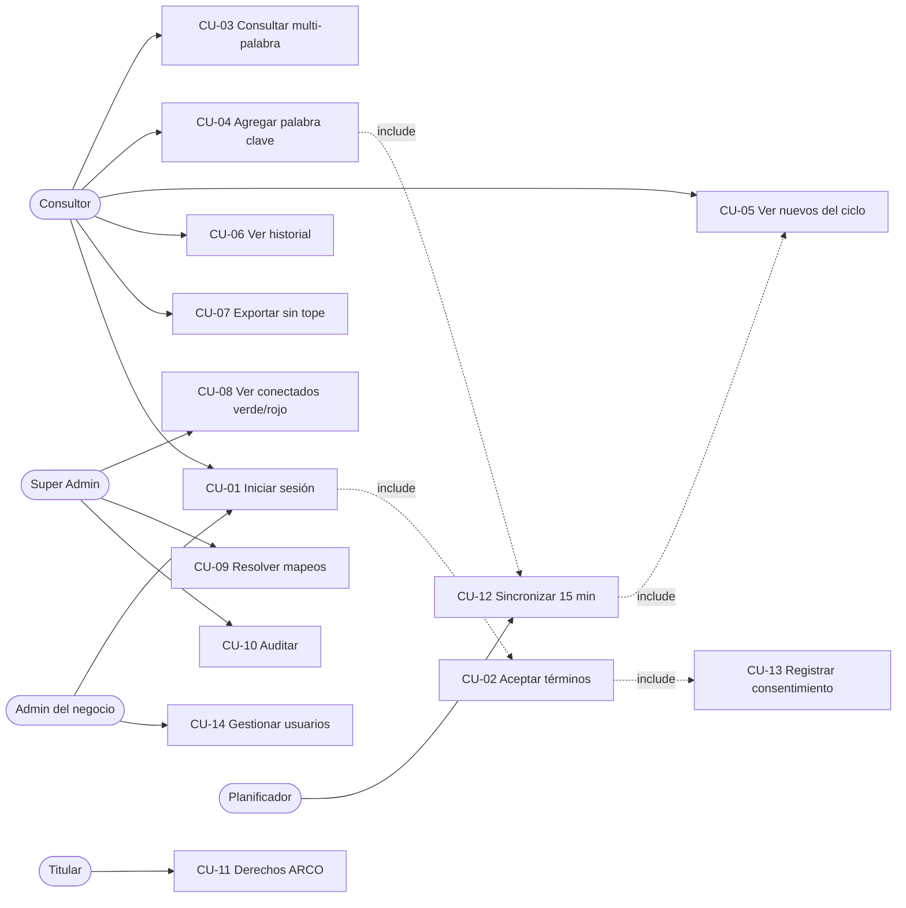
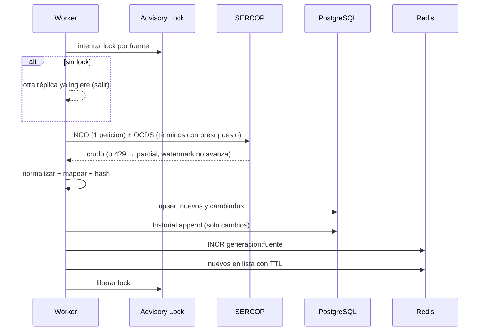
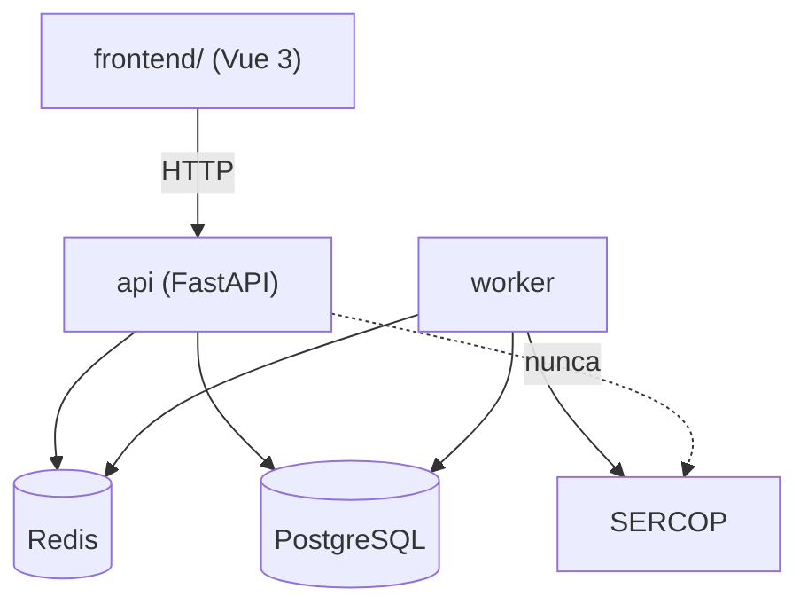
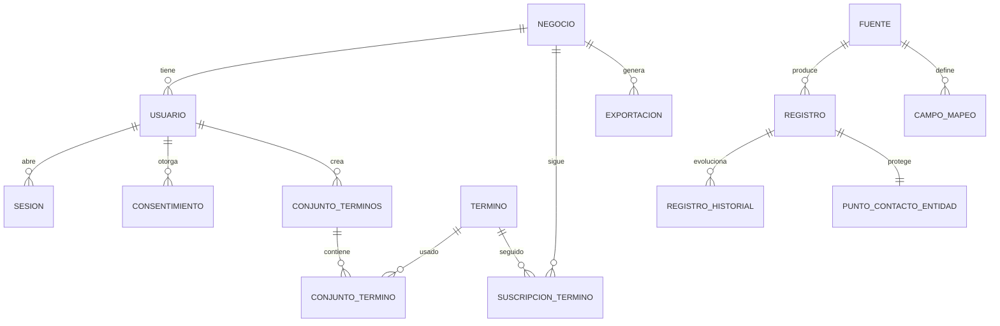

# documentacion.md
# Plataforma SERCOP Multi-Tenant — Documentación del Proyecto

| Campo | Valor |
|---|---|
| Proyecto | Plataforma de inteligencia de contratación pública (SERCOP) multi-tenant |
| Versión del documento | 0.1 (borrador) |
| Estado | En planificación — F0 no iniciada |
| Responsable de mantenimiento | Ingeniero QA |
| Última actualización | 2026-09-27 |

> **Documento vivo.** Cada fase cierra completando su sección en el capítulo 10. Una fase sin
> documentación no está terminada.

---

## 1. Resumen ejecutivo

Herramienta SaaS que convierte los datos públicos de contratación del SERCOP (Ecuador) en
información oportuna para consultorías: acumula histórico propio, permite consultas multi-palabra
de respuesta rápida, exporta a Excel sin límite y conserva evidencia de cumplimiento legal.
La arquitectura es un monolito modular con capas hexagonales, dos procesos (`api` y `worker`),
PostgreSQL con aislamiento por negocio (RLS) y Redis como capa más cercana al cliente.

**Restricción que gobierna todo el diseño:** el SERCOP limita la tasa de peticiones (HTTP 429).
Ninguna acción de un usuario puede originar una petición a la fuente; solo el `worker` la consume,
con presupuesto acotado por ciclo.

---

## 2. Objetivos

### 2.1 Objetivo general
Disponer de una plataforma comercializable, segura y auditable que entregue inteligencia de
contratación pública con datos acumulados propios, soportando 50+ negocios sin degradar el
servicio ni saturar las fuentes oficiales.

### 2.2 Objetivos específicos

| # | Objetivo | Indicador | Meta | Fase |
|---|---|---|---|---|
| OE-1 | Acumular histórico propio de contrataciones | Ciclos exitosos por día | ≥1, con 0 pérdidas sin registro | F2 |
| OE-2 | Consulta rápida para el consultor | p95 de consulta cacheada | < 300 ms | F3 |
| OE-3 | Ingesta incremental correcta | Duplicados por clave natural | 0 | F2 |
| OE-4 | Desacoplar la BD del tráfico de usuarios | Aciertos de caché en hora pico | ≥ 80% | F3 |
| OE-5 | No bloquear el SERCOP | Peticiones originadas por usuarios | 0 | F2, F3 |
| OE-6 | Cumplir la LOPDP y demostrarlo | Usuarios con consentimiento versionado | 100% | F5 |
| OE-7 | Multiusuario seguro y aislado | Fugas entre negocios detectadas | 0 | F1, F4 |
| OE-8 | Visibilidad operativa en tiempo real | Latencia del cambio de presencia | < 2 s (proactivo) / ≤ 60 s (piso) | F4 |
| OE-9 | Calidad verificable | Cobertura en dominio y aplicación | ≥ 80% | Transversal |

---

## 3. Alcance

### 3.1 Incluido
Arquitectura multi-tenant con RLS · ingesta automática cada 15 min con deduplicación global ·
mapeo automático de filas y columnas · búsqueda multi-palabra (seleccionar y agregar) · capa
Redis-first · autenticación con roles y sesiones limitadas · panel de super administrador con
presencia en tiempo real · exportación a Excel sin tope (por criterios o por selección) ·
cumplimiento LOPDP · documentación y trazabilidad por fase.

### 3.2 Excluido
Escritura hacia el SERCOP (el sistema es de solo lectura) · microservicios · aplicación móvil ·
facturación y pasarela de pago · RediSearch · despliegue dedicado por cliente · eliminación del
módulo administrativo (queda para v2).

### 3.3 Alcance por fase

| Fase | Alcance |
|---|---|
| F0 | Repositorio seguro, entorno local, esqueleto hexagonal, CI |
| F1 | Modelo relacional multi-tenant, RLS, migraciones |
| F2 | Ingesta 15 min, mapeo automático, historial |
| F3 | Caché Redis-first, multi-palabra, ingesta bajo demanda |
| F4 | Auth, sesiones, evicción, presencia, super admin |
| F5 | Cumplimiento LOPDP: consentimiento, ARCO, retención, cifrado |
| F6 | Exportación sin tope, frontend, retiro del legado |

---

## 4. Actores y partes interesadas

| Actor | Tipo | Interés |
|---|---|---|
| Consultor | Usuario | Encontrar oportunidades a tiempo y exportarlas |
| Administrador del negocio | Usuario | Gestionar su equipo y sus términos |
| Super Administrador | Usuario | Operar la plataforma, resolver mapeos, auditar |
| Planificador | Sistema | Ingesta periódica confiable |
| Titular de datos | Externo | Ejercer derechos sobre sus datos personales |
| Cliente (consultoría) | Parte interesada | Responsable del tratamiento; exige cumplimiento |
| SPDP | Regulador | Exige evidencia de cumplimiento LOPDP |

---

## 5. Requisitos

### 5.1 Funcionales

| ID | Requisito | Fase |
|---|---|---|
| RF-01 | Alta de negocios y usuarios (1 negocio : N usuarios; 1 usuario : 1 negocio) | F1 |
| RF-02 | Autenticación con access + refresh token y rotación | F4 |
| RF-03 | Máximo 2 sesiones simultáneas; el 3.º login revoca la más antigua | F4 |
| RF-04 | Estados de usuario y de sesión, con auditoría de cada cambio | F4 |
| RF-05 | Gate de primer login: lectura completa y aceptación de términos | F5 |
| RF-06 | Registro de consentimiento con versión, hash, IP y user-agent | F5 |
| RF-07 | Ingesta automática cada 15 min con ventana de solape de 2 ciclos | F2 |
| RF-08 | Alta incremental: insertar nuevos, actualizar cambiados, historial append-only | F2 |
| RF-09 | Detección automática de campos nuevos sin pérdida del payload original | F2 |
| RF-10 | Resolución de mapeos pendientes desde el panel administrativo | F2, F6 |
| RF-11 | Búsqueda con N palabras clave seleccionadas y/o agregadas, modo AND/OR | F3 |
| RF-12 | Ingesta bajo demanda al agregar una palabra clave nueva, con ventana de recuperación histórica y turno garantizado en la cola | F3 |
| RF-13 | Exportación a Excel de todos los procesos filtrados o seleccionados, sin tope | F6 |
| RF-14 | Panel de presencia: conectados/desconectados en tiempo real, verde/rojo, con motivo | F4 |
| RF-15 | Auditoría inmutable de acciones sensibles | F4, F5 |
| RF-16 | Canal de solicitudes ARCO con plazo calculado a 15 días hábiles | F5 |
| RF-17 | Exportación del Registro de Actividades de Tratamiento (RAT) | F5 |
| RF-18 | Cifrado del contacto de funcionarios y retención automática | F5 |
| RF-19 | El administrador solo ve los usuarios **registrados** en su propio negocio y su estado de conexión (verde/rojo); nunca usuarios ni datos de otro negocio | F4 |
| RF-20 | El administrador concede o retira el acceso a cada vista del panel por plazos cerrados (7 días, 30 días, 3 meses, 6 meses, 1 año) | F3.5 |
| RF-21 | El vencimiento lo calcula el backend como instante absoluto; el cliente nunca envía fechas ni plazos fuera del catálogo | F3.5 |
| RF-22 | El acceso se comprueba al leer y la retirada es inmediata, incluso con el permiso en caché | F3.5 |

### 5.2 No funcionales

| ID | Categoría | Requisito | Meta |
|---|---|---|---|
| RNF-01 | Desempeño | Consulta cacheada | p95 < 300 ms |
| RNF-02 | Desempeño | Consulta en BD | < 1,5 s |
| RNF-03 | Escalabilidad | Negocios soportados | 50+ en el primer año |
| RNF-04 | Disponibilidad | Operación si Redis cae | Degradación a BD con avisos |
| RNF-05 | Seguridad | Aislamiento entre negocios | 0 fugas; RLS forzado |
| RNF-06 | Seguridad | Almacenamiento de credenciales | Argon2id |
| RNF-07 | Seguridad | Cifrado de datos personales | AES-256-GCM en columna |
| RNF-08 | Cumplimiento | LOPDP | Consentimiento demostrable, ARCO, retención |
| RNF-09 | Mantenibilidad | Tipado y estilo | mypy estricto + ruff en CI |
| RNF-10 | Testabilidad | Cobertura dominio/aplicación | ≥ 80% |
| RNF-11 | Observabilidad | Trazabilidad de ingesta y errores | Logs estructurados + métricas por ciclo |
| RNF-12 | Portabilidad | Cambio de BD local a remota | Solo cambiar `DATABASE_URL` |
| RNF-13 | Integridad | Respuestas JSON sin `NaN`/`Infinity` | 0 ocurrencias |
| RNF-14 | Usabilidad | Claridad ante fallos parciales | Mensajes vía `avisos`, nunca error crudo |

### 5.3 Restricciones
- **R-01** Ninguna petición de usuario puede originar tráfico hacia el SERCOP.
- **R-02** Presupuesto de peticiones acotado por ciclo (configurable).
- **R-03** Un solo ciclo de ingesta concurrente (advisory lock).
- **R-04** `negocio_id` se toma siempre del JWT, nunca del cliente.
- **R-05** El rol de aplicación no puede ser superusuario (saltaría RLS).
- **R-06** NCO no expone histórico: solo se acumula desde la primera ingesta.

---

## 6. Casos de uso

### 6.1 Tabla resumen

| ID | Caso de uso | Actor | Precondición | Resultado esperado | Criterio de aceptación |
|---|---|---|---|---|---|
| CU-01 | Iniciar sesión | Todos | Usuario activo | Sesión con tokens | 3.º login expulsa la más antigua en <2 s |
| CU-02 | Aceptar términos en primer login | Todos | Primer acceso o versión nueva | Consentimiento registrado | Sin aceptar no hay acceso; se guarda versión+hash+IP+UA |
| CU-03 | Consultar con múltiples palabras clave | Consultor | Sesión activa | Resultado paginado | p95 < 300 ms; 0 llamadas a SERCOP |
| CU-04 | Agregar palabra clave nueva | Consultor | Sesión activa | Término en cola + resultados parciales | Respuesta inmediata con estado de ingesta |
| CU-05 | Ver procesos nuevos del ciclo | Consultor | Ingesta previa | Lista de nuevos | Visibles < 15 min tras publicarse |
| CU-06 | Ver historial de un proceso | Consultor | Proceso en BD | Cambios con fecha | Cada cambio tiene fecha de detección |
| CU-07 | Exportar todos los procesos filtrados | Consultor | Resultado no vacío | Archivo Excel | Sin tope; enlace válido 24 h |
| CU-08 | Ver usuarios conectados/desconectados | Admin del negocio | Rol autorizado | Panel con semáforo | Actualización asíncrona sin recargar; **solo usuarios registrados en su negocio** |
| CU-09 | Resolver mapeo de columnas pendiente | Super Admin | Existe pendiente | Campo canónico asignado | El ciclo siguiente puebla la columna |
| CU-10 | Auditar acciones | Super Admin | — | Registro consultable | Toda acción sensible registrada |
| CU-11 | Ejercer derechos ARCO | Titular | — | Solicitud registrada | Vencimiento a 15 días hábiles calculado |
| CU-12 | Sincronizar fuentes cada 15 min | Planificador | Ciclo vencido | Nuevos/actualizados + caché invalidada | 1 solo ciclo concurrente |
| CU-13 | Registrar consentimiento | Sistema | Aceptación previa | Evidencia almacenada | Versión, hash, IP y UA presentes |
| CU-14 | Gestionar usuarios del negocio | Admin del negocio | Rol autorizado | Usuario creado/editado | No puede ver datos de otro negocio |
| CU-15 | Conceder acceso a una vista por un plazo | Admin del negocio | Rol autorizado | Concesión con vencimiento | El vencimiento es ahora + el plazo, calculado en el servidor |
| CU-16 | Retirar el acceso a una vista | Admin del negocio | Existía concesión | Sin acceso y con historial | Deja de conceder en la petición siguiente |

### 6.2 Ficha CU-04 — Agregar palabra clave nueva *(caso crítico)*

| Elemento | Detalle |
|---|---|
| Actor | Consultor |
| Precondición | Sesión activa; términos permitidos por el negocio |
| Disparador | El usuario escribe y agrega un término que no está en el catálogo |
| Flujo principal | 1. El API normaliza el término y lo crea/recupera en el catálogo global. 2. Crea la suscripción del negocio. 3. Responde de inmediato con resultados parciales y `estado_ingesta`. 4. Encola el término. 5. El `worker` lo ingesta respetando el presupuesto. 6. El frontend consulta el estado y refresca. |
| Flujos alternos | 4a. El término ya tiene ingesta reciente → no se encola. 4b. El mismo término lo pidieron otros negocios → se reutiliza la ingesta (deduplicación global). |
| Excepciones | 5a. HTTP 429 → estado `parcial`, watermark **no avanza**, se avisa. 5b. Presupuesto agotado → queda `en_cola` para el ciclo siguiente. |
| Postcondición | Resultados completos cuando la ingesta termina |
| Reglas | **Nunca** se llama al SERCOP dentro del request. Backfill por año solo en OCDS; en NCO no existe histórico. |

### 6.3 Ficha CU-08 — Ver usuarios conectados/desconectados

| Elemento | Detalle |
|---|---|
| Actor | Administrador del negocio |
| Precondición | Sesión con rol autorizado |
| **Alcance de visibilidad** | **Solo usuarios registrados y pertenecientes a su propio negocio**, en cualquiera de sus estados. No puede ver usuarios de otros negocios ni cuentas de plataforma. Esto no depende del código de la consulta: el aislamiento lo impone RLS (`app.negocio_id` sale del token, nunca del cliente). |
| Flujo principal | 1. El frontend abre un canal SSE. 2. El API se suscribe a Redis Pub/Sub del negocio. 3. Emite el estado inicial. 4. Cada heartbeat o cierre publica un evento. 5. El panel repinta el color sin recargar. |
| Estados y colores | Verde `#22c55e` = conectado (presencia viva + token activo). Rojo `#ef4444` = desconectado. |
| Motivos mostrados | `logout` · `cierre_ventana` · `heartbeat_vencido` · `expirado` · `eviccion` · `admin` |
| Excepciones | Cierre abrupto del navegador → no llega el beacon → el rojo se refleja al vencer el TTL (≤60 s) |
| Postcondición | El panel refleja el estado real de **los usuarios del negocio** |

### 6.4 Diagrama de casos de uso

### 6.5 Diagrama de secuencia — ingesta y caché

---

## 7. Arquitectura

- **Estilo:** monolito modular con puertos y adaptadores. La infraestructura implementa puertos; el dominio no depende de nada.
- **Dos procesos:** `api` (tráfico de usuarios) y `worker` (ingesta, exportaciones, retención).
- **Redis-first (lectura):** `clave = hash(filtros) + generacion:fuente`; TTL = un ciclo.
- **Decisiones registradas:** ADR-000 (fundamentos, lenguaje, arquitectura, BD, Redis, planificador, migración incremental) y ADR-001 (multi-tenant, palabras clave, modelo de datos, exportación, admin desmontable).

---

## 8. Modelo de datos

**Plano compartido** (sin `negocio_id`): `fuente`, `campo_mapeo`, `campo_pendiente`, `termino`,
`registro`, `registro_historial`, `sincronizacion`.
**Plano de negocio** (`negocio_id` + RLS forzado): `negocio`, `usuario`, `sesion`,
`suscripcion_termino`, `conjunto_terminos`, `conjunto_termino`, `filtro_guardado`, `exportacion`,
`consentimiento`, `solicitud_arco`, `auditoria`, `politica_version`.
**Tablas particionadas por mes:** `registro_historial`, `auditoria`.
**Extensiones:** `pg_trgm`, `unaccent`, `pgcrypto`, `citext`.

---

## 9. Fases de desarrollo y documentación

| Fase | Objetivo | Estado | Documento | Casos de uso |
|---|---|---|---|---|
| F0 | Cimientos y seguridad del repositorio | **Completada** — 2026-09-27 | [`docs/00-fase-0.md`](docs/00-fase-0.md) | — |
| F1 | Modelo multi-tenant + RLS | **Completada** — 2026-09-27 | [`docs/01-fase-1.md`](docs/01-fase-1.md) | RF-01, CU-14 |
| F2 | Ingesta + mapeo automático | **Completada** — 2026-09-27 | [`docs/02-fase-2.md`](docs/02-fase-2.md) | CU-05, CU-06, CU-12 |
| F3 | Redis-first + multi-palabra | **Completada** — 2026-09-27 | [`docs/03-fase-3.md`](docs/03-fase-3.md) | CU-03, CU-04 |
| F3.5 | Acceso a vistas por suscripción | **Completada** — 2026-09-27 | [`docs/03b-fase-3b-acceso-vistas.md`](docs/03b-fase-3b-acceso-vistas.md) | CU-15, CU-16 |
| F4 | Auth, sesiones, presencia | Pendiente | `docs/04-fase-4.md` | CU-01, CU-08, CU-10 |
| F5 | Cumplimiento LOPDP | Pendiente | `docs/05-fase-5.md` | CU-02, CU-11, CU-13 |
| F6 | Export sin tope + frontend | Pendiente | `docs/06-fase-6.md` | CU-07, CU-09 |

### 9.1 Registro de implementaciones

> Esta tabla se completa al cerrar cada fase. Una fase sin fila aquí **no está terminada**.

| Fase | Fecha cierre | Implementado | Archivos/símbolos clave | Pruebas | Evidencia | Deuda |
|---|---|---|---|---|---|---|
| F0 | 2026-09-27 (parcial) | Repositorio seguro, esqueleto hexagonal, configuración con fallo rápido, app con `/salud` y `/listo`, diagnóstico de conexiones, adaptación a proveedor gestionado, CI | `.gitignore`, `.env.example`, `backend/pyproject.toml`, `ajustes.py`, `app.py`, `asgi.py`, `routers/salud.py`, `bd/sesion.py`, `cache/cliente.py`, `scripts/preparar_entorno.py`, `scripts/verificar_conexiones.py`, `.github/workflows/ci.yml` | 22 pasan · 1 omitida · integración Postgres pasa, Redis pendiente | `ruff: All checks passed` · `ruff format: 30 files` · `mypy: no issues found in 27 source files` · `pytest: 22 passed, 1 skipped` · `pip-audit: No known vulnerabilities found` · Supabase: `postgres OK` | Instalar Redis · motor atado al ciclo de vida · `uv.lock` · inicializar Git · rotar la contraseña compartida por chat |
| F1 | 2026-09-27 | Esquema completo (19 tablas), RLS forzado con políticas por negocio, particionado mensual, migraciones reversibles, caché opcional | `alembic/env.py`, `alembic/versions/0001_esquema_inicial.py`, `0002_aislamiento_rls.py`, `aplicacion/puertos/cache.py`, `cache/{cliente,nula,redis}.py`, `routers/salud.py` | 22 de unidad · 8 de integración | `ruff` y `mypy` limpios · `alembic downgrade base` → `upgrade head` sin errores · `test_un_negocio_no_ve_los_datos_de_otro` **PASSED** · `/listo` → 200 | Crear el rol de aplicación real · job de particiones futuras (F2) · verificar email único por negocio |
| F2 | 2026-09-27 | Ingesta cada 15 min con solape, mapeo dirigido por datos, detección de campos nuevos, historial *append-only*, límite de tasa y exclusión mutua, worker ejecutable | `dominio/ingesta.py`, `dominio/palabras.py`, `aplicacion/mapeo.py`, `aplicacion/casos_uso/ejecutar_ingesta.py`, `aplicacion/puertos/fuente.py`, `infraestructura/salida/bd/{ingesta,bloqueo}.py`, `infraestructura/salida/fuentes/{limitador,nco,ocds,nco_mapeos,ocds_mapeos}.py`, `tareas/{planificador,worker}.py` | 68 de unidad · 14 de integración | `ruff: All checks passed` · `ruff format: 56 files` · `mypy: no issues found in 50 source files` · idempotencia, historial, pendientes, marca de agua y caché verificados sobre PostgreSQL real · `alembic current` → `0002 (head)` **sin cambios de esquema** | `registro.terminos_ids` en F3 · mantenimiento de particiones en F3 · el worker necesita proceso persistente (no sirve un entorno sin servidor) · 48 h continuas se validan en operación |
| F3 | 2026-09-27 | Caché por delante en toda lectura con invalidación por generación, búsqueda multi-palabra con modos `todas`/`cualquiera` sobre texto completo, catálogos y estadísticas cacheadas, alta de palabras clave sin llamar a la fuente, estado de ingesta | `dominio/busqueda.py`, `dominio/serializacion.py`, `aplicacion/generaciones.py`, `aplicacion/casos_uso/{buscar_registros,encolar_termino}.py`, `salida/bd/{consultas,terminos,contexto}.py`, `routers/{busqueda,terminos,ingestas}.py` | 162 de unidad · 29 de integración | `ruff` y `mypy` limpios · 4 defectos reales corregidos, entre ellos decimales devueltos como texto y una conexión reutilizada que fallaba en lugar de denegar | El `worker` no consume aún la cola priorizada · umbrales de búsqueda por revisar con datos reales |
| F3.5 | 2026-09-27 | Concesión de acceso a vistas por plazos cerrados con vencimiento absoluto, comprobado al leer; retirada inmediata con caché; tablero de las cuatro vistas en verde y rojo; aislamiento por RLS en tabla propia | `dominio/acceso.py`, `aplicacion/{actor.py,casos_uso/gestionar_acceso.py}`, `aplicacion/puertos/accesos.py`, `salida/bd/accesos.py`, `alembic/versions/{0003_acceso_vistas,0004_politicas_contexto_vacio}.py`, `routers/accesos.py`, `scripts/estado_esquema.py` | 38 de unidad · 15 de integración | Sobre la base real con un rol sin privilegios: aislamiento forzado, contexto vacío deniega, `CHECK` rechaza plazos inventados · `estado_esquema.py` destapa que el rol actual se salta RLS | Las vistas aún no se exigen en los endpoints de lectura · presencia y aviso de vencimiento en F4 |
| F4 | — | — | — | — | — | — |
| F5 | — | — | — | — | — | — |
| F6 | — | — | — | — | — | — |

### 9.2 Plantilla obligatoria por fase (`docs/0N-fase-N.md`)

    # Fase N — <nombre>
    ## 1. Objetivo
    ## 2. Alcance (incluido / excluido)
    ## 3. Implementaciones realizadas   (qué se construyó, archivo/símbolo)
    ## 4. Decisiones tomadas y justificación
    ## 5. Casos de uso cubiertos (CU-xx) y requisitos (RF-xx / RNF-xx)
    ## 6. Pruebas ejecutadas y resultado real
    ## 7. Evidencia de aceptación (comandos y salidas)
    ## 8. Deuda técnica y pendientes
    ## 9. Riesgos abiertos y mitigaciones
    ## 10. Aprobación (QA + Revisor)

---

## 10. Plan de pruebas

| Nivel | Alcance | Herramienta | Criterio de salida |
|---|---|---|---|
| Unidad | Dominio y aplicación | pytest | Cobertura ≥80%; 0 fallos |
| Integración | Postgres y Redis reales | pytest + contenedores | Aislamiento cross-tenant = 0 filas |
| Contrato | Parseo SERCOP con fixtures | pytest | Salida idéntica a los fixtures |
| Restricciones | Rate limit, caché, idempotencia | pytest + dobles | 0 peticiones originadas por usuarios |
| Carga | p95 y aciertos de caché | herramienta de carga | p95 <300 ms; aciertos ≥80% |
| E2E | Flujo completo de usuario | navegador automatizado | Flujo sin errores de consola |
| Seguridad | Dependencias y configuración | pip-audit + revisión | 0 altas/críticas |

**Regla:** cada criterio de aceptación debe mapearse a al menos una prueba. Un criterio sin prueba es un criterio no cumplido.

---

## 11. Seguridad y cumplimiento (LOPDP)

| Control | Implementación | Fase |
|---|---|---|
| Aislamiento por negocio | RLS forzado + `negocio_id` desde el JWT | F1 |
| Credenciales | Argon2id | F4 |
| Sesiones | Máx. 2, rotación de refresh, detección de reuso | F4 |
| Datos personales | AES-256-GCM en columna + clave gestionada aparte | F5 |
| Retención | `vigente_hasta` + job automático | F5 |
| Consentimiento | Gate de primer login + registro versionado con evidencia | F5 |
| Derechos del titular | Canal ARCO con vencimiento a 15 días hábiles | F5 |
| Accountability | RAT exportable + auditoría inmutable | F5 |
| Cookies | Solo cookie de refresh `HttpOnly; Secure` (estrictamente necesaria → sin banner) | F4 |
| Brechas | Procedimiento documentado de notificación | F5 |

**Roles legales:** para los datos consultados, el **cliente es Responsable** y la plataforma
**Encargado** (Acuerdo de Encargado conforme a la normativa). Para las cuentas de usuario, la
plataforma es Responsable.
**Límite honesto:** ninguna arquitectura otorga inmunidad legal; reduce el riesgo y permite
demostrar diligencia.

---

## 12. Riesgos

| ID | Riesgo | Prob. | Impacto | Mitigación |
|---|---|---|---|---|
| RS-01 | Fuga de datos entre negocios | Media | Crítico | RLS forzado + prueba automatizada en CI |
| RS-02 | 429 sostenido detiene la ingesta | Alta | Alto | Presupuesto, cooldown, watermark que no avanza |
| RS-03 | Pérdida irreversible de histórico NCO | Alta | Alto | Arrancar F2 cuanto antes; historial append-only |
| RS-04 | Redis caído degrada el servicio | Media | Medio | Fallback a BD con avisos |
| RS-05 | Hambruna de términos en cola | Media | Medio | Prioridad + tope de antigüedad |
| RS-06 | Exportación masiva tumba el worker | Media | Medio | Proceso separado, streaming, umbral |
| RS-07 | Evicción usada como ataque | Media | Medio | Auditoría, notificación, rate limit de login |
| RS-08 | Secretos filtrados al repositorio | Media | Crítico | `.gitignore` en F0 + escaneo en CI |

---

## 13. Matriz de trazabilidad

| Objetivo | Requisitos | Casos de uso | Fase | Verificación |
|---|---|---|---|---|
| OE-1 | RF-07, RF-08 | CU-05, CU-12 | F2 | 48 h sin ciclos perdidos |
| OE-2 | RNF-01 | CU-03 | F3 | Prueba de carga p95 |
| OE-3 | RF-08 | CU-06, CU-12 | F2 | 0 duplicados |
| OE-4 | RNF-04 | CU-03 | F3 | Métrica de aciertos |
| OE-5 | R-01, R-02 | CU-04, CU-12 | F2, F3 | Auditoría de tráfico saliente |
| OE-6 | RF-05, RF-06, RF-16, RF-17 | CU-02, CU-11, CU-13 | F5 | Registro de consentimientos |
| OE-7 | RF-03, RF-04, RNF-05 | CU-01, CU-14 | F1, F4 | Prueba cross-tenant |
| OE-8 | RF-14 | CU-08 | F4 | Beacons y TTL medidos |
| OE-9 | RNF-10 | — | Transversal | Reporte de cobertura |

---

## 14. Glosario

| Término | Significado |
|---|---|
| NCO | Necesidades de Contratación (fuente del portal SERCOP) |
| OCDS | Open Contracting Data Standard (datos abiertos del SERCOP) |
| Negocio | Cliente de la plataforma (tenant); tiene N usuarios |
| RLS | Row Level Security de PostgreSQL; garantiza el aislamiento por negocio |
| Redis-first | La lectura se resuelve en Redis; la BD solo en caso de fallo de caché |
| Generación | Contador que invalida lógicamente toda la caché al cerrar un ciclo |
| Watermark | Marca de agua temporal que indica hasta dónde se ingirió |
| Ventana de solape | Margen (2 ciclos) que evita perder registros entre ejecuciones |
| Campo pendiente | Columna detectada en la fuente sin mapeo canónico definido |
| ARCO | Acceso, Rectificación, Cancelación y Oposición (derechos del titular) |
| RAT | Registro de Actividades de Tratamiento |
| LOPDP | Ley Orgánica de Protección de Datos Personales (Ecuador) |
| SPDP | Superintendencia de Protección de Datos Personales |

---

## 15. Control de cambios del documento

| Versión | Fecha | Cambio | Responsable |
|---|---|---|---|
| 0.1 | 2026-09-27 | Versión inicial: objetivos, alcance, requisitos, casos de uso, arquitectura, fases y plan de pruebas | Ingeniero QA |
| 0.2 | 2026-09-27 | Fase 0 en curso: se registran implementaciones, pruebas y evidencia real; capítulo 9.1 completado para F0 | Ingeniero QA |
| 0.3 | 2026-09-27 | Conexión a PostgreSQL gestionado (Supabase) verificada; adaptación de la URI y diagnóstico de conexiones; 5 defectos corregidos | Ingeniero QA |
| 0.4 | 2026-09-27 | Fase 1 completada: esquema de 19 tablas, aislamiento por RLS verificado con prueba automatizada, caché opcional y documentación por fase | Ingeniero QA |
| 0.5 | 2026-09-27 | Fase 2 completada sin cambios de base de datos: ingesta cada 15 min, mapeo automático de columnas, conservación del crudo y historial. Se documenta la decisión de la marca de agua en ciclos parciales. Nuevo **RF-19** y precisión del alcance del administrador en CU-08 (solo usuarios registrados y conectados de su propio negocio). Seis defectos reales encontrados por las pruebas y corregidos | Ingeniero QA |
| 0.6 | 2026-09-27 | Fases 3 y 3.5 completadas. F3: caché por delante con invalidación por generación, búsqueda multi-palabra sobre texto completo y alta de palabras clave sin llamar a la fuente. F3.5: acceso a vistas por plazos cerrados, con el vencimiento calculado en el servidor y comprobado al leer. Nuevos RF-20 a RF-22 y CU-15, CU-16. Cuatro defectos reales corregidos, entre ellos decimales devueltos como texto y, sobre todo, que una conexión reutilizada del grupo fallaba en lugar de denegar el acceso. Se añade `scripts/estado_esquema.py`, que destapa que el rol de conexión actual se salta RLS | Ingeniero QA |